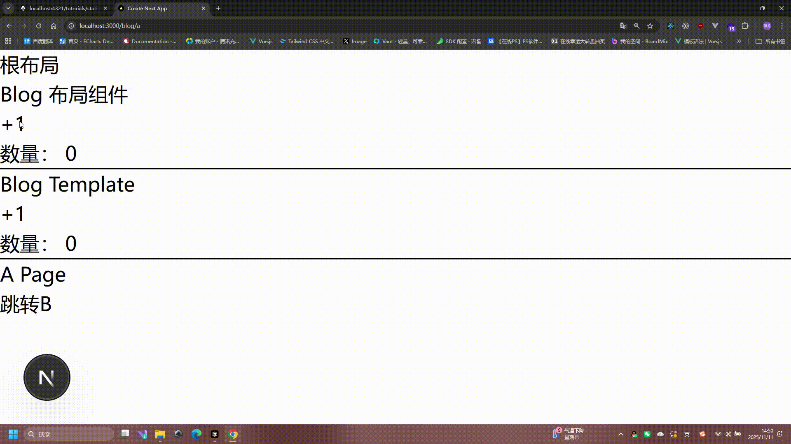
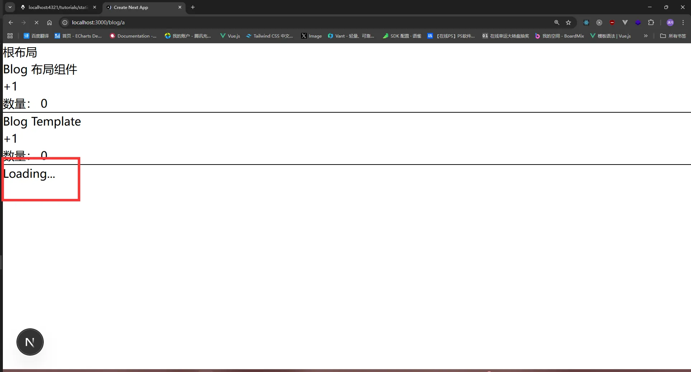
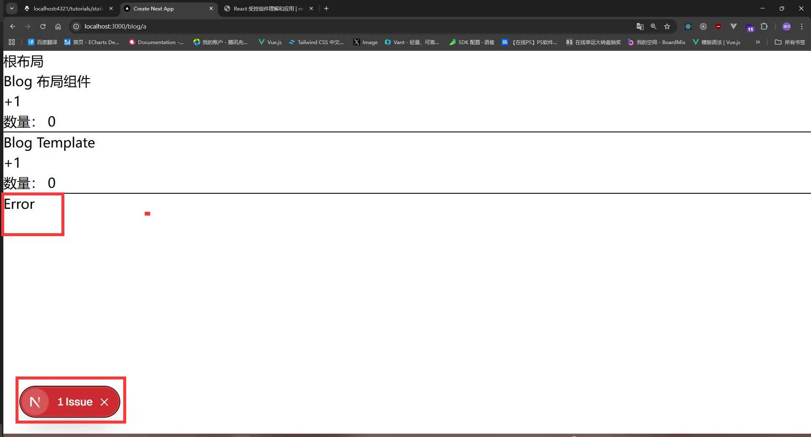
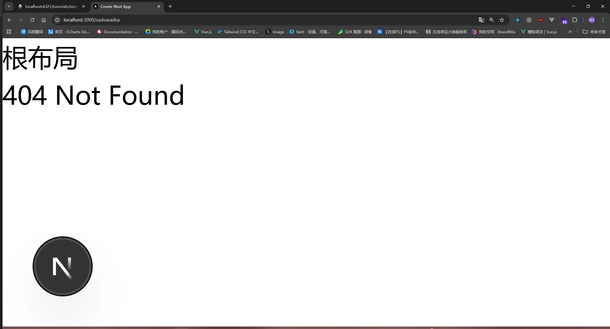

# 入门

git clone https://github.com/Liujialin0820/next--xiaoman.git

https://nextjs-docs-henna-six.vercel.app/

```shell
npx create-next-app@latest
```

- What is your project named? » my-app `项目名称（必填）`
- Would you like to use the recommended Next.js defaults? `是否使用推荐配置` 这里我选自定义配置 `No, customize settings`
- Would you like to use TypeScript? » No / Yes `是否使用TypeScript` 这里我选是 `Yes`
- Which linter would you like to use? » ESLint / Biome / None `是否使用ESLint` 这里我选是 `None`
- Would you like to use React Compiler? » No / Yes `是否使用React Compiler` 这里我选是 `Yes`
- Would you like to use Tailwind CSS? » No / Yes `是否使用Tailwind CSS` 这里我选是 `Yes`
- Would you like to use `src/app` directory? » No / Yes `是否使用src/app目录` 这里我选是 `Yes`
- Would you like to use App Router? (recommended) » No / Yes `是否使用App Router` 这里我选是 `Yes`
- Would you like to use Turbopack? (recommended) » No / Yes `是否使用Turbopack` 这里我选是 `Yes`
- Would you like to customize the import alias (`@/*` by default)? » No / Yes 是否自定义导入别名 `@/*` 这里我选是 `Yes`
- What import alias would you like configured? » @/* 是否自定义导入别名 `@/*` 这里我选是 默认 `@/*`

选择完成之后，他会执行`npm install`安装依赖，安装完成之后，他会执行`npm run dev`启动项目，访问`http://localhost:3000`即可看到项目。

## 目录结构介绍

```
public/ -> 静态资源目录
src/ -> 源代码目录
  └─app/ -> App Router目录
     └─layout.tsx -> 跟布局(必须存在 且必须包含html body标签)
     └─page.tsx -> 首页
     └─globals.css -> 全局样式
next-env.d.ts -> TypeScript类型定义文件
next.config.ts -> Next.js配置文件
tsconfig.json -> TypeScript配置文件
postcss.config.mjs -> PostCSS配置文件(主要用于处理tailwindcss)
package.json -> 包管理文件
README.md -> 项目说明文件
```

## 命令介绍

```
next dev -> 启动开发服务器 -> npm run dev
next build -> 构建项目 -> npm run build
next start -> 启动生产服务器 -> npm run start
```


### 什么是React Compiler?

React Compiler 是Next.js 用于自动优化组件渲染来提高性能的工具，在之前的话，我们需要手动优化`useMemo` / `useCallback` /`memo`等，现在Next.js会自动优化，你只需要写代码即可,减少心智负担。

如何开启React Compiler? `如果你在选项中选择yes则无需安装`

```
npm install -D babel-plugin-react-compiler
```

next.config.ts

```tsx
import type { NextConfig } from 'next'
 
const nextConfig: NextConfig = {
  reactCompiler: true, //开启即可
}
 
export default nextConfig
```


### 什么是App Router?

Next.js 有两套路由系统，一个是旧的`Pages Router`路由系统，一个是新的`App Router`路由系统。

首先Next.js 首推的是`App Router`路由系统

- `Pages Router`的路由系统是会把`pages`目录下的所有jsx/tsx文件，都转换成路由，例如`pages/index.tsx`会转换成`/`路由，`pages/about.tsx`会转换成`/about`路由，但是这样components也变成了地址了.

- `App Router`的路由系统是根据约定定义的，目录结构如下

```
src/
└── app
    ├── page.tsx -> / 首页
    ├── layout.tsx -> 布局组件
    ├── template.tsx -> 模板组件
    ├── loading.tsx -> 加载组件
    ├── error.tsx -> 错误组件
    └── not-found.tsx -> 404组件
    ├── xiaoman
    │   └── page.tsx -> /xiaoman 小满页面
    └── daman
        └── page.tsx -> /daman 大满页面
```

- `Pages Router` 读取数据需要使用`getServerSideProps` / `getStaticProps` / `getStaticPaths`等函数，而`App Router`则不需要，直接在组件中使用`fetch`调用即可。

Pages Router:

```
export async function getServerSideProps() {
  const res = await fetch('xxx');
  const data = await res.json();
  return { props: { data } };
}
export default function Home({ data }) {
  return <div>{data.name}</div>;
}
```

App Router:

```
export default async function Home() {
  const res = await fetch('xxx');
  const data = await res.json();
  return <div>{data.name}</div>;
}
```


# 路由

## App Router

### Next.js 路由基础

在 Next.js 中，app 目录下的每个文件夹都代表一个路由段（route segment），并直接映射到 URL 路径。无需配置路由表，框架会根据您的文件结构自动处理。

#### page(页面)

```
app/
├── page.tsx               # /
├── about/
│   └── page.tsx           # /about
├── blog/test
│        └── page.tsx      # /blog/test
└── contact/
    └── page.tsx           # /contact复制
```

### layout && template

`layout`(布局) 布局是多个页面共享UI，例如导航栏、侧边栏、底部等。 同一个文件夹下所有的页面都会自动共享

`template`(模板) 基本功能跟布局一样，只是不会保存状态



布局和模板的特点就是：

- **布局嵌套**：支持多层布局嵌套，构建复杂的页面结构
- **状态管理**：布局会在页面切换时保持状态，而模板会重新渲染
- **根布局**：app/layout.tsx 是必须存在的根布局文件
- **渲染顺序**：当布局和模板同时存在时，渲染顺序为 layout → template → page

目录结构如下:

```
app
└─ blog
   ├─ layout.tsx
   ├─ template.tsx
   ├─ a
   │  └─ page.tsx
   └─ b
      └─ page.tsx
```

app/blog/layout.tsx

```tsx
'use client' //需要交互的地方要改为客户端组件 默认是服务端组件
import { useState } from "react"
export default function BlogLayout({ children }: { children: React.ReactNode }) {
    const [count, setCount] = useState(0)
    return (
        <div>
            <h1>Blog 布局组件</h1>
            <button onClick={() => setCount(count + 1)}>+1</button>
            <h1>数量： {count}</h1>
            <hr />
            {children}
        </div>
    )
}
```

app/blog/template.tsx

```tsx
'use client' //需要交互的地方要改为客户端组件 默认是服务端组件
import { useState } from "react"
export default function BlogTemplate({ children }: { children: React.ReactNode }) {
    const [count, setCount] = useState(0)
    return (
        <div>
            <h1>Blog Template</h1>
            <button onClick={() => setCount(count + 1)}>+1</button>
            <h1>数量： {count}</h1>
            <hr />
            {children}
        </div>
    )
}
```

app/blog/a/page.tsx

```tsx
import Link from "next/link"
export default function APage() {
    return (
        <div>
            <h1>A Page</h1>
            <Link href="/blog/b">跳转B</Link>
        </div>
    )
}
```

app/blog/b/page.tsx

```tsx
import Link from "next/link"
export default function BPage() {
    return (
        <div>
            <h1>B Page</h1>
            <Link href="/blog/a">跳转A</Link>
        </div>
    )
}
```


### loading(加载)



Next.js的loading是借助了`Suspense`实现的，Suspense的具体用法请参考[Suspense 组件](https://message163.github.io/react-docs/react/components/suspense.html)

app/blog/loading.tsx

```tsx
export default function Loading() {
    return (
        <div>
            <h1>Loading...</h1>
        </div>
    )
}
```

app/blog/a/page.tsx

```tsx
import Link from "next/link"
const getData = async () => {
  //触发异步会自动跳转到loading组件 异步结束正常返回页面
  return new Promise((resolve) => {
    setTimeout(() => {
      resolve("数据")
    }, 5000)
  })
}
export default async function APage() {
    const data = await getData()
    console.log(data)
    return (
        <div>
            <h1>A Page</h1>
            <Link href="/blog/b">跳转B</Link>
        </div>
    )
}
```


### error(错误)



Next.js的error是借助了`Error Boundary`实现的。

app/blog/error.tsx

```tsx
'use client' //错误组件必须是客户端组件
export default function Error() {
    return (
        <div>
            <h1>Error</h1>
        </div>
    )
}
```

app/blog/a/page.tsx

```tsx
import Link from "next/link"
export default async function APage() {
   //遇到异常会自动跳转到error组件
    throw new Error("错误")
    return (
        <div>
            <h1>A Page</h1>
            <Link href="/blog/b">跳转B</Link>
        </div>
    )
}
```


### not-found(404)



其实Next.js 默认会生成一个404页面，但我们可能自定义404页面，只需要在app目录下创建一个not-found.tsx文件即可

app/not-found.tsx

```tsx
export default function NotFound() {
    return (
        <div>
            <h1>404 Page</h1>
        </div>
    )
}
```


## 路由导航

在Next.js中，共有四种方式提供跳转:

- `Link`组件
- `useRouter` Hook (客户端组件)
- `redirect`函数 (服务端组件)
- `History API` (浏览器API **本文略过用的不多** 了解即可)

### Link组件

`<Link>`是一个内置组件，在a标签的基础上扩展了功能，并且还能用来实现预获取(prefetch)，以及保持滚动位置(scroll)等。

### 基本用法

```tsx
import Link from "next/link" //引入Link组件
export default function Home() {
    return (
        <div>
            <Link href="/about">跳转About页面</Link>
            
            <Link href={{pathname: "/about", query: {name: "张三"}}}>跳转About并且传入参数/about?name=张三</Link>
            
            <Link href="/page" prefetch={true}>预获取page页面</Link>
            
            <Link href="/xm" scroll={true}>保持滚动位置</Link>
            
            <Link href="/daman" replace={true}>替换当前页面</Link>
        </div>
    )
}
```

### 支持动态渲染

```tsx
import Link from "next/link"
export default function Page() {
    const arr = [1, 2, 3, 4, 5]
    return arr.map((item) => (
        <Link key={item} href={`/page/${item}`}>动态渲染的Link</Link>
    ))
}
```

### useRouter Hook

useRouter 可以在代码中根据逻辑跳转页面，例如根据用户权限跳转不同的页面。

使用该hook需要在客户端组件中。需要在顶层编写 `'use client'` 声明这是客户端组件。

```tsx
'use client'
import { useRouter } from "next/navigation"
export default function Page() {
    const router = useRouter()
    return (
        <>
        <button onClick={() => router.push("/page")}>跳转page页面</button>
        <button onClick={() => router.replace("/page")}>替换当前页面</button>
        <button onClick={() => router.back()}>返回上一页</button>
        <button onClick={() => router.forward()}>跳转下一页</button>
        <button onClick={() => router.refresh()}>刷新当前页面</button>
        <button onClick={() => router.prefetch("/about")}>预获取about页面</button>
        </>
    )
}
```

### redirect 函数

redirect 函数可以用于服务端组件/客户端组件中跳转页面，例如根据用户权限跳转不同的页面。

**在Next.js中 redirect的状态是：307临时重定向**

```
import { redirect } from "next/navigation"
export default async function Page() {
   const checkLogin = await checkLogin()
   //如果用户未登录，则跳转到登录页面
   if (!checkLogin) {
    redirect("/login")
   }
   return (
    <div>
        <h1>Page</h1>
    </div>
   )
}复制
```

### permanentRedirect 函数

permanentRedirect 跟上面的redirect的区别是：permanentRedirect是永久重定向，而redirect是临时重定向。

**在Next.js中 permanentRedirect的状态是：308永久重定向**

```
//用法跟redirect一样，只是状态码不同
import { permanentRedirect } from "next/navigation"
export default async function Page() {
   const checkLogin = await checkLogin()
   if (!checkLogin) {
    permanentRedirect("/login")
   }
}复制
```

### permanentRedirect / redirect 参数说明

这两个函数都接受以下参数：

- `path`：字符串类型，表示重定向的目标 URL（支持相对路径和绝对路径）
- `type`：可选参数，值为 `replace` 或 `push`，用于控制重定向的行为

**关于 type 参数的默认行为：**

- 在 **Server Actions** 中：默认使用 `push`，会将新页面添加到浏览器历史记录
- 在 **其他场景** 中：默认使用 `replace`，会替换当前的浏览器历史记录

你可以通过显式指定 `type` 参数来覆盖默认行为。

> ⚠️ **注意**：`type` 参数在服务端组件中无效，仅在客户端组件和 Server Actions 中生效。