# 入门

https://nextjs-docs-henna-six.vercel.app/

```git
git clone https://github.com/Liujialin0820/next--xiaoman.git
```

```shell
npx create-next-app@latest
```

- What is your project named? » my-app `项目名称（必填）`
- Would you like to use the recommended Next.js defaults? `是否使用推荐配置` 这里我选自定义配置 `No, customize settings`
- Would you like to use TypeScript? » No / Yes `是否使用TypeScript` 这里我选是 `Yes`
- Which linter would you like to use? » ESLint / Biome / None `是否使用ESLint` 这里我选是 `None`
- Would you like to use React Compiler? » No / Yes `是否使用React Compiler` 这里我选是 `Yes`
- Would you like to use Tailwind CSS? » No / Yes `是否使用Tailwind CSS` 这里我选是 `Yes`
- Would you like to use `src/app` directory? » No / Yes `是否使用src/app目录` 这里我选是 `Yes`
- Would you like to use App Router? (recommended) » No / Yes `是否使用App Router` 这里我选是 `Yes`
- Would you like to use Turbopack? (recommended) » No / Yes `是否使用Turbopack` 这里我选是 `Yes`
- Would you like to customize the import alias (`@/*` by default)? » No / Yes 是否自定义导入别名 `@/*` 这里我选是 `Yes`
- What import alias would you like configured? » @/* 是否自定义导入别名 `@/*` 这里我选是 默认 `@/*`

选择完成之后，他会执行`npm install`安装依赖，安装完成之后，他会执行`npm run dev`启动项目，访问`http://localhost:3000`即可看到项目。

## 目录结构介绍

```
public/ -> 静态资源目录
src/ -> 源代码目录
  └─app/ -> App Router目录
     └─layout.tsx -> 跟布局(必须存在 且必须包含html body标签)
     └─page.tsx -> 首页
     └─globals.css -> 全局样式
next-env.d.ts -> TypeScript类型定义文件
next.config.ts -> Next.js配置文件
tsconfig.json -> TypeScript配置文件
postcss.config.mjs -> PostCSS配置文件(主要用于处理tailwindcss)
package.json -> 包管理文件
README.md -> 项目说明文件
```

## 命令介绍

```
next dev -> 启动开发服务器 -> npm run dev
next build -> 构建项目 -> npm run build
next start -> 启动生产服务器 -> npm run start
```


### 什么是React Compiler?

React Compiler 是Next.js 用于自动优化组件渲染来提高性能的工具，在之前的话，我们需要手动优化`useMemo` / `useCallback` /`memo`等，现在Next.js会自动优化，你只需要写代码即可,减少心智负担。

如何开启React Compiler? `如果你在选项中选择yes则无需安装`

```
npm install -D babel-plugin-react-compiler
```

next.config.ts

```tsx
import type { NextConfig } from 'next'
 
const nextConfig: NextConfig = {
  reactCompiler: true, //开启即可
}
 
export default nextConfig
```


### 什么是App Router?

Next.js 有两套路由系统，一个是旧的`Pages Router`路由系统，一个是新的`App Router`路由系统。

首先Next.js 首推的是`App Router`路由系统

- `Pages Router`的路由系统是会把`pages`目录下的所有jsx/tsx文件，都转换成路由，例如`pages/index.tsx`会转换成`/`路由，`pages/about.tsx`会转换成`/about`路由，但是这样components也变成了地址了.

- `App Router`的路由系统是根据约定定义的，目录结构如下

```
src/
└── app
    ├── page.tsx -> / 首页
    ├── layout.tsx -> 布局组件
    ├── template.tsx -> 模板组件
    ├── loading.tsx -> 加载组件
    ├── error.tsx -> 错误组件
    └── not-found.tsx -> 404组件
    ├── xiaoman
    │   └── page.tsx -> /xiaoman 小满页面
    └── daman
        └── page.tsx -> /daman 大满页面
```

- `Pages Router` 读取数据需要使用`getServerSideProps` / `getStaticProps` / `getStaticPaths`等函数，而`App Router`则不需要，直接在组件中使用`fetch`调用即可。

Pages Router:

```
export async function getServerSideProps() {
  const res = await fetch('xxx');
  const data = await res.json();
  return { props: { data } };
}
export default function Home({ data }) {
  return <div>{data.name}</div>;
}
```

App Router:

```
export default async function Home() {
  const res = await fetch('xxx');
  const data = await res.json();
  return <div>{data.name}</div>;
}
```


# 路由

## App Router

### Next.js 路由基础

在 Next.js 中，app 目录下的每个文件夹都代表一个路由段（route segment），并直接映射到 URL 路径。无需配置路由表，框架会根据您的文件结构自动处理。

#### page(页面)

```
app/
├── page.tsx               # /
├── about/
│   └── page.tsx           # /about
├── blog/test
│        └── page.tsx      # /blog/test
└── contact/
    └── page.tsx           # /contact复制
```

### layout && template

`layout`(布局) 布局是多个页面共享UI，例如导航栏、侧边栏、底部等。 同一个文件夹下所有的页面都会自动共享

`template`(模板) 基本功能跟布局一样，只是不会保存状态


布局和模板的特点就是：

- **布局嵌套**：支持多层布局嵌套，构建复杂的页面结构
- **状态管理**：布局会在页面切换时保持状态，而模板会重新渲染
- **根布局**：app/layout.tsx 是必须存在的根布局文件
- **渲染顺序**：当布局和模板同时存在时，渲染顺序为 layout → template → page

目录结构如下:

```
app
└─ blog
   ├─ layout.tsx
   ├─ template.tsx
   ├─ a
   │  └─ page.tsx
   └─ b
      └─ page.tsx
```

app/blog/layout.tsx

```tsx
'use client' //需要交互的地方要改为客户端组件 默认是服务端组件
import { useState } from "react"
export default function BlogLayout({ children }: { children: React.ReactNode }) {
    const [count, setCount] = useState(0)
    return (
        <div>
            <h1>Blog 布局组件</h1>
            <button onClick={() => setCount(count + 1)}>+1</button>
            <h1>数量： {count}</h1>
            <hr />
            {children}
        </div>
    )
}
```

app/blog/template.tsx

```tsx
'use client' //需要交互的地方要改为客户端组件 默认是服务端组件
import { useState } from "react"
export default function BlogTemplate({ children }: { children: React.ReactNode }) {
    const [count, setCount] = useState(0)
    return (
        <div>
            <h1>Blog Template</h1>
            <button onClick={() => setCount(count + 1)}>+1</button>
            <h1>数量： {count}</h1>
            <hr />
            {children}
        </div>
    )
}
```

app/blog/a/page.tsx

```tsx
import Link from "next/link"
export default function APage() {
    return (
        <div>
            <h1>A Page</h1>
            <Link href="/blog/b">跳转B</Link>
        </div>
    )
}
```

app/blog/b/page.tsx

```tsx
import Link from "next/link"
export default function BPage() {
    return (
        <div>
            <h1>B Page</h1>
            <Link href="/blog/a">跳转A</Link>
        </div>
    )
}
```


### loading(加载)


Next.js的loading是借助了`Suspense`实现的，Suspense的具体用法请参考[Suspense 组件](https://message163.github.io/react-docs/react/components/suspense.html)

app/blog/loading.tsx

```tsx
export default function Loading() {
    return (
        <div>
            <h1>Loading...</h1>
        </div>
    )
}
```

app/blog/a/page.tsx

```tsx
import Link from "next/link"
const getData = async () => {
  //触发异步会自动跳转到loading组件 异步结束正常返回页面
  return new Promise((resolve) => {
    setTimeout(() => {
      resolve("数据")
    }, 5000)
  })
}
export default async function APage() {
    const data = await getData()
    console.log(data)
    return (
        <div>
            <h1>A Page</h1>
            <Link href="/blog/b">跳转B</Link>
        </div>
    )
}
```


### error(错误)


Next.js的error是借助了`Error Boundary`实现的。

app/blog/error.tsx

```tsx
'use client' //错误组件必须是客户端组件
export default function Error() {
    return (
        <div>
            <h1>Error</h1>
        </div>
    )
}
```

app/blog/a/page.tsx

```tsx
import Link from "next/link"
export default async function APage() {
   //遇到异常会自动跳转到error组件
    throw new Error("错误")
    return (
        <div>
            <h1>A Page</h1>
            <Link href="/blog/b">跳转B</Link>
        </div>
    )
}
```


### not-found(404)


其实Next.js 默认会生成一个404页面，但我们可能自定义404页面，只需要在app目录下创建一个not-found.tsx文件即可

app/not-found.tsx

```tsx
export default function NotFound() {
    return (
        <div>
            <h1>404 Page</h1>
        </div>
    )
}
```


## 路由导航

在Next.js中，共有四种方式提供跳转:

- `Link`组件
- `useRouter` Hook (客户端组件)
- `redirect`函数 (服务端组件)
- `History API` (浏览器API **本文略过用的不多** 了解即可)

### Link组件

`<Link>`是一个内置组件，在a标签的基础上扩展了功能，并且还能用来实现预获取(prefetch)，以及保持滚动位置(scroll)等。

**基本用法**

```tsx
import Link from "next/link" //引入Link组件
export default function Home() {
    return (
        <div>
            <Link href="/about">跳转About页面</Link>
            
            <Link href={{pathname: "/about", query: {name: "张三"}}}>跳转About并且传入参数/about?name=张三</Link>
            
            {/* 这些都是默认打开的 但是很有用 */}
            <Link href="/page" prefetch={true}>预获取page页面</Link>
            
            <Link href="/xm" scroll={true}>保持滚动位置</Link>
            
            {/* 默认关闭的, 不保存浏览器记录 */}
            <Link href="/daman" replace={true}>替换当前页面</Link>
        </div>
    )
}
```

**支持动态渲染**

```tsx
import Link from "next/link"
export default function Page() {
    const arr = [1, 2, 3, 4, 5]
    return arr.map((item) => (
        <Link key={item} href={`/page/${item}`}>动态渲染的Link</Link>
    ))
}
```

### useRouter Hook

useRouter 可以在代码中根据逻辑跳转页面，例如根据用户权限跳转不同的页面。

使用该hook需要在客户端组件中。需要在顶层编写 `'use client'` 声明这是客户端组件。

```tsx
'use client'
import { useRouter } from "next/navigation"
export default function Page() {
    const router = useRouter()
    return (
        <>
        <button onClick={() => router.push("/page")}>跳转page页面</button>
        <button onClick={() => router.replace("/page")}>替换当前页面</button>
        <button onClick={() => router.back()}>返回上一页</button>
        <button onClick={() => router.forward()}>跳转下一页</button>
        <button onClick={() => router.refresh()}>刷新当前页面</button>
        <button onClick={() => router.prefetch("/about")}>预获取about页面</button>
        </>
    )
}
```

### redirect 函数

redirect 函数可以用于服务端组件/客户端组件中跳转页面，例如根据用户权限跳转不同的页面。

**在Next.js中 redirect的状态是：307临时重定向**

```
import { redirect } from "next/navigation"
export default async function Page() {
   const checkLogin = await checkLogin()
   //如果用户未登录，则跳转到登录页面
   if (!checkLogin) {
    redirect("/login")
   }
   return (
    <div>
        <h1>Page</h1>
    </div>
   )
}复制
```

### permanentRedirect 函数

permanentRedirect 跟上面的redirect的区别是：permanentRedirect是永久重定向，而redirect是临时重定向。

**在Next.js中 permanentRedirect的状态是：308永久重定向**

```
//用法跟redirect一样，只是状态码不同
import { permanentRedirect } from "next/navigation"
export default async function Page() {
   const checkLogin = await checkLogin()
   if (!checkLogin) {
    permanentRedirect("/login")
   }
}复制
```

### permanentRedirect / redirect 参数说明

这两个函数都接受以下参数：

- `path`：字符串类型，表示重定向的目标 URL（支持相对路径和绝对路径）
- `type`：可选参数，值为 `replace` 或 `push`，用于控制重定向的行为

**关于 type 参数的默认行为：**

- 在 **Server Actions** 中：默认使用 `push`，会将新页面添加到浏览器历史记录
- 在 **其他场景** 中：默认使用 `replace`，会替换当前的浏览器历史记录

你可以通过显式指定 `type` 参数来覆盖默认行为。

> ⚠️ **注意**：`type` 参数在服务端组件中无效，仅在客户端组件和 Server Actions 中生效。


## 动态路由

`/blog/[id]`，其中`[id]`就是动态路由参数，我们需要根据不同的id来显示不同的页面内容，例如商品详情页，文章详情页等。

### 基本用法[slug]

使用动态路由只需要在文件夹名加上方括号`[]`即可，例如`[id]`,`[params]`等，名字可以自定义。

来看demo: 我们在`app/shop`目录下创建一个`[id]`目录

```tsx
//app/shop/[id]/page.tsx
export default function Page() {
    return <div>Page</div>
}
```

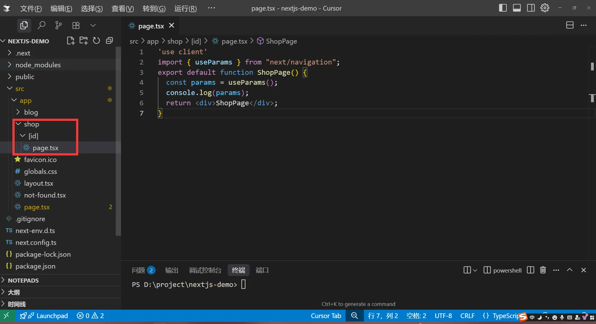

访问路径为:`http://localhost:3000/shop/123` 其中`123`就是动态路由参数，这个可以是任意值。

### 路由片段[…slug]

我们如果需要捕获多个路由参数，例如`/shop/123/456`，我们可以使用路由片段来捕获多个路由参数，他的用法就是`[...slug]`，其中`slug`就是路由片段，这个名字可以自定义，后面的片段有多少就捕获多少。

```tsx
//app/shop/[...id]/page.tsx
export default function Page() {
    return <div>Page</div>
}
```

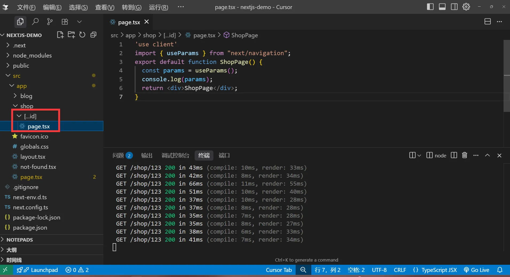

访问路径为:`http://localhost:3000/shop/123/456/789` 其中`123`和`456`和`789`就是动态路由参数，后面的片段有多少就捕获多少。

### 可选路由[[…slug]]

可选路由指的是，我们可能会有这个路由参数，也可能会没有这个路由参数，例如`/shop/123`，也可能是`/shop`，我们可以使用可选路由来捕获这个路由参数，他的用法就是`[[...slug]]`，其中`slug`就是路由片段，这个名字可以自定义，后面的片段有多少就捕获多少。

```tsx
//app/shop/[[...id]]/page.tsx
export default function Page() {
    return <div>Page</div>
}
```

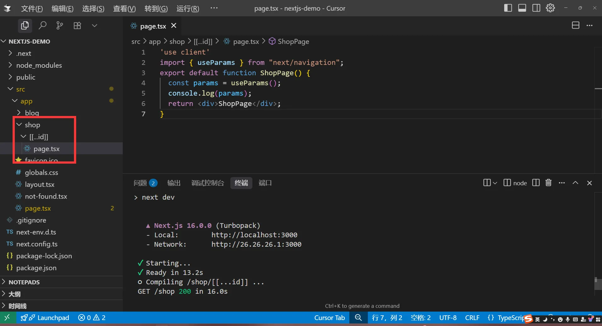

- 访问路径为:`http://localhost:3000/shop`，可以没有参数
- 访问路径为:`http://localhost:3000/shop/123`，可以有参数
- 访问路径为:`http://localhost:3000/shop/123/456`，可以有多个参数

这种方式比较灵活。

### 接受参数

使用`useParams` hook来接受参数，这个hook只能在客户端组件中使用。

```tsx
'use client'
import { useParams } from "next/navigation";
export default function ShopPage() {
  const params = useParams();
  console.log(params); //{id: '123'}  {id: ['123', '456']} 接受单个值以及多个值
  return <div>ShopPage</div>;
}
```


## 平行路由

平行路由指的是在同一布局`layout.tsx`中，可以同时渲染多个页面，例如`team`，`analytics`等，这个东西跟`vue`的`router-view`类似。

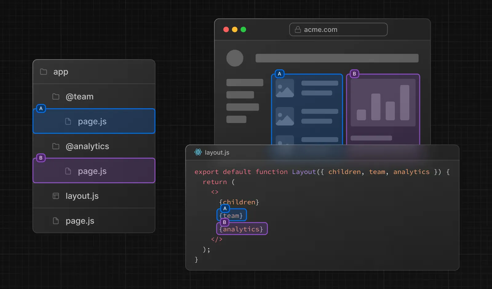

### 基本用法

平行路由的使用方法就是通过`@` + 文件夹名来定义，例如`@team`，`@analytics`等，名字可以自定义。

> 平行路由也不会影响`URL`路径。

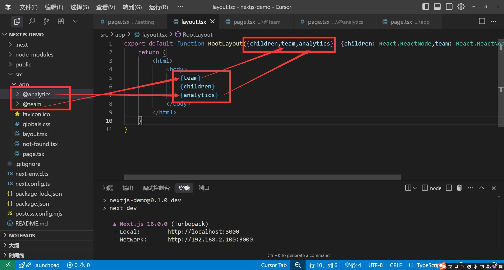

定义完成之后，我们就可以在`layout.tsx`中使用`team`和`analytics`来渲染对应的页面，他会自动注入`layout`的props里面

> 注意：例子中我们使用了解构的语法，这里面的名称`team`,`analytics`需跟文件夹名称一致。

```tsx
export default function RootLayout({children,team,analytics}: 
{children: React.ReactNode,team: React.ReactNode,analytics: React.ReactNode}
) {
    return (
        <html>
            <body>
                {team}
                {children}
                {analytics}
            </body>
        </html>
    )
}
```

### 独立路由

当我们使用了平行路由之后，我们为其单独定义`loading`,`error`,等组件使其拥有独立加载和错误处理的能力。

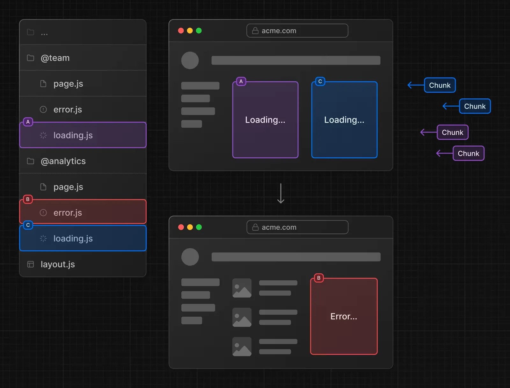

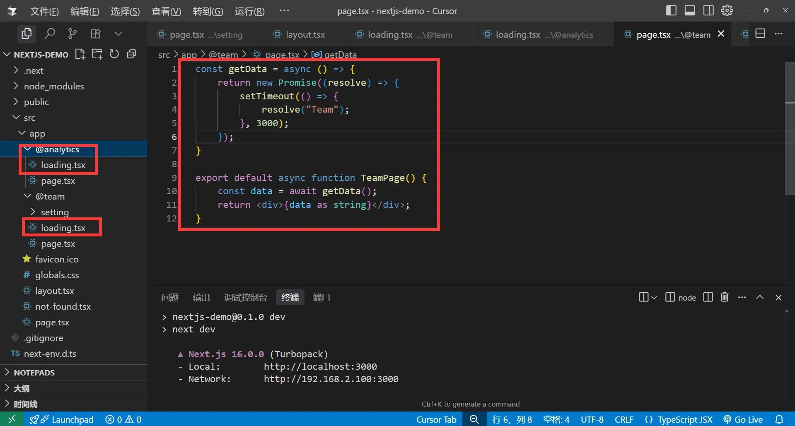

首先我们先认识一下子导航，每一个平行路由下面还可以接着创建对应的路由，例如`@team`下面可以接着创建`@team/setting`，`@team/user`等。

那我们的目录结构就是：

```
├── @team
│   ├── page.tsx
│   ├── setting
│   │   └── page.tsx
└── @analytics
│    └── page.tsx
└── layout.tsx   
└── page.tsx
```

然后我们使用`Link`组件跳转子导航`setting`页面

```tsx
import Link from "next/link"
export default function RootLayout({children,team,analytics}: 
{children: React.ReactNode,team: React.ReactNode,analytics: React.ReactNode}) {
    return (
        <html>
            <body>
                {team}
                {children}
                {analytics}
                <Link className="text-blue-500 block" href="/setting">Setting</Link>
            </body>
        </html>
    )
}
```

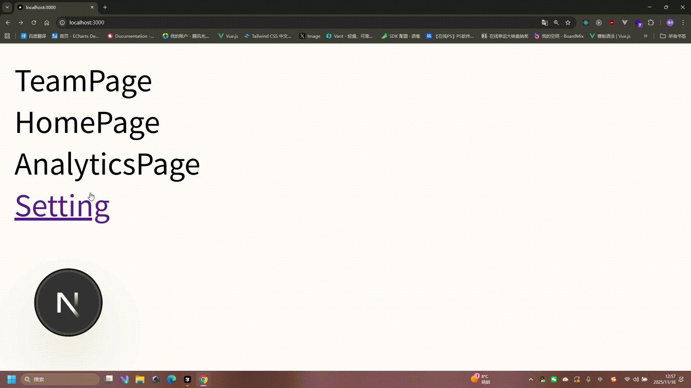

观察上图我们发现，子导航使用`Link`组件跳转`setting`页面时，是`软导航`没有问题的，但是我们在跳转之后刷新页面，就出现`404`了，这是怎么回事?

- 当使用软导航`Link`组件跳转子页面的时候，这时候`@analytics` 和 `children` 依然保持活跃，所以他只会替代`@team`里面的内容。
- 而当我们使用硬导航`浏览器页面刷新`,此时`@analytics` 和 `children` 已经失活，因为它的底层原理其实是同时匹配`@team`和`@analytics`，`children` 目录下面的`setting` 页面，但是只有`@team` 有这个页面，其他两个没有，所以导致`404`。

解决方案：使用`default.tsx`来进行兜底，确保不会`404`

- @analytics/default.tsx 定义default.tsx文件
- app/default.tsx 定义default.tsx文件

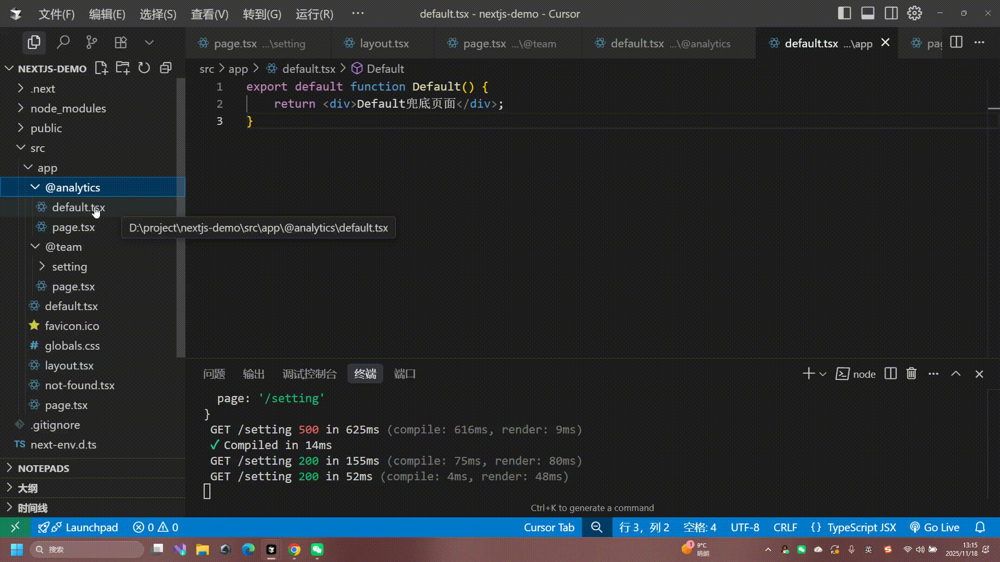


## 路由组

路由组也是一种基于文件夹的约定范式，可以让我们开发者，按类别或者团队组织路由模块，并且不影响 URL 路径。

用法：只需要通过`(groupName)`包裹住文件夹名即可，例如`(shop)`，`(user)`等，名字可以自定义。

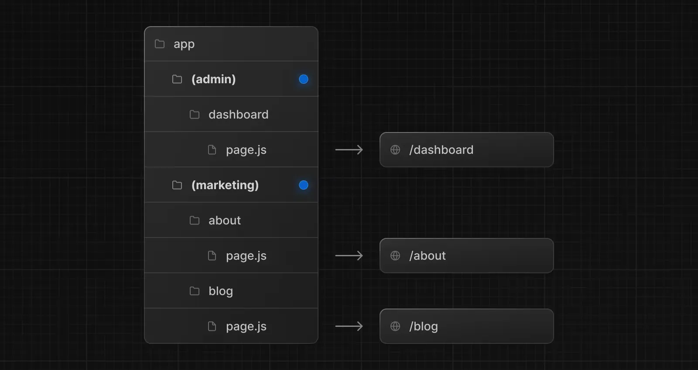

### 定义多个根布局

这种一般是大型项目使用的，例如我们需要把，`后台管理系统`和`前台的门户网站`，放到一个项目就可以使用这种方法实现。

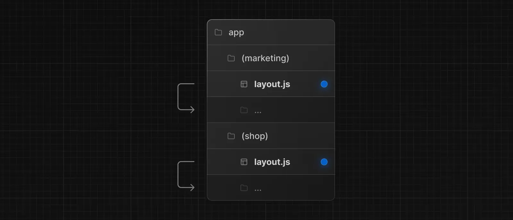

使用方法：

1. 先把`app`目录下的`layout.tsx` 文件删除
2. 在每组的目录下创建`layout.tsx`文件，并且定义`html`,`body`标签。

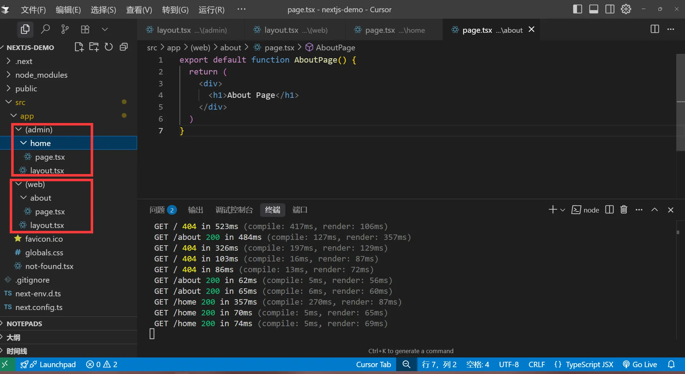


# API -路由处理程序(Route Handlers)

路由处理程序，可以让我们在Next.js中编写API接口，并且支持与客户端组件的交互，真正做到了什么叫`前后端分离人不分离`。

### 文件结构

定义前端路由页面我们使用的`page.tsx`文件，而定义API接口我们使用的`route.ts`文件，并且他两都不受文件夹的限制，可以放在任何地方，只需要文件的名称以`route.ts`结尾即可。

> 注意：`page.tsx`文件和`route.ts`文件不能放在同一个文件夹下，否则会报错，因为Next.js就搞不清到底用哪一个了，所以我们最好把前后端代码分开。

为此我们可以定义一个`api`文件夹，然后在这个文件夹下创建一对应的模块例如`user` `login` `register`等。

目录结构如下

```
app/
├── api
│   ├── user
│   │   └── route.ts
│   ├── login
│   │   └── route.ts
│   └── register
│       └── route.ts
```

### 定义请求

Next.js是遵循`RESTful API`的规范，所以我们可以使用HTTP方法来定义请求。

```tsx
export async function GET(request) {}
 
export async function HEAD(request) {}
 
export async function POST(request) {}
 
export async function PUT(request) {}
 
export async function DELETE(request) {}
 
export async function PATCH(request) {}
 
//如果没有定义OPTIONS方法，则Next.js会自动实现OPTIONS方法
export async function OPTIONS(request) {}
```

> 注意: 我们在定义这些请求方法的时候`不能修改方法名称而且必须是大写`，否则无效。

工具准备: 打开vsCode / Cursor 找到插件市场搜索`REST Client`，安装完成后，我们可以使用`REST Client`来测试API接口。

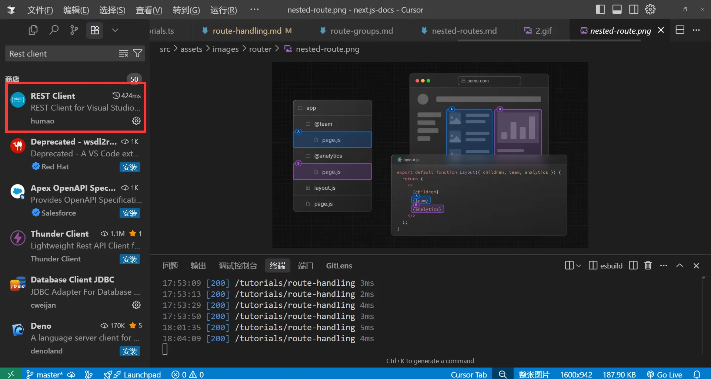

### 定义GET请求

src/app/api/user/route.ts

```tsx
import { NextRequest, NextResponse } from "next/server";
export async function GET(request: NextRequest) {
    const query = request.nextUrl.searchParams; //接受url中的参数
    console.log(query.get('id'));
    return NextResponse.json({ message: 'Get request successful' }); //返回json数据
}
```

REST client测试:

在src目录新建`test.http`文件，编写测试请求

src/test.http

```http
GET http://localhost:3000/api/user?id=123 HTTP/1.1
```

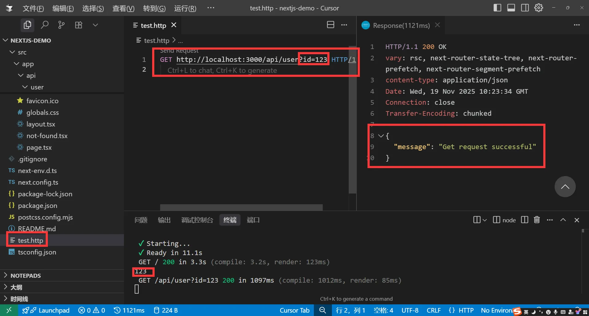

### 定义Post请求

src/app/api/user/route.ts

```tsx
import { NextRequest, NextResponse } from "next/server";
export async function POST(request: NextRequest){
    //const body = await request.formData(); //接受formData数据
    //const body = await request.text(); //接受text数据
    //const body = await request.arrayBuffer(); //接受arrayBuffer数据
    //const body = await request.blob(); //接受blob数据
    const body = await request.json(); //接受json数据
    console.log(body); //打印请求体中的数据
    return NextResponse.json({ message: 'Post request successful', body },{status: 201});
     //返回json数据
}
```

REST client测试:

src/test.http

```http
POST http://localhost:3000/api/user HTTP/1.1
Content-Type: application/json

{
    "name": "张三",
    "age": 18
}
```


### 动态参数

我们可以在路由中使用方括号`[]`来定义动态参数，例如`/api/user/[id]`，其中`[id]`就是动态参数，这个参数可以在请求中传递，这个跟前端路 由的动态路由类似。

**src/app/api/user/[id]/route.ts**

接受动态参参数，需要在第二个参数解构{ params },需注意这个参数是异步的，所以需要使用`await`来等待参数解析完成。

```tsx
import { NextRequest, NextResponse } from "next/server";
export async function GET(request: NextRequest, 
{ params }: { params: Promise<{ id: string }> }) {
    const { id } = await params;
    console.log(id);
    return NextResponse.json({ message: `Hello, ${id}!` });
}
```

REST client测试:

src/test.http

```http
GET http://localhost:3000/api/user/886 HTTP/1.1
```

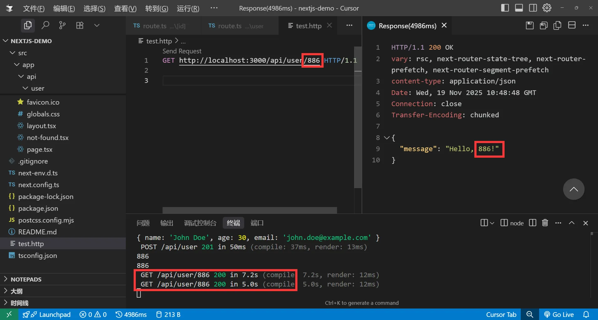

### cookie

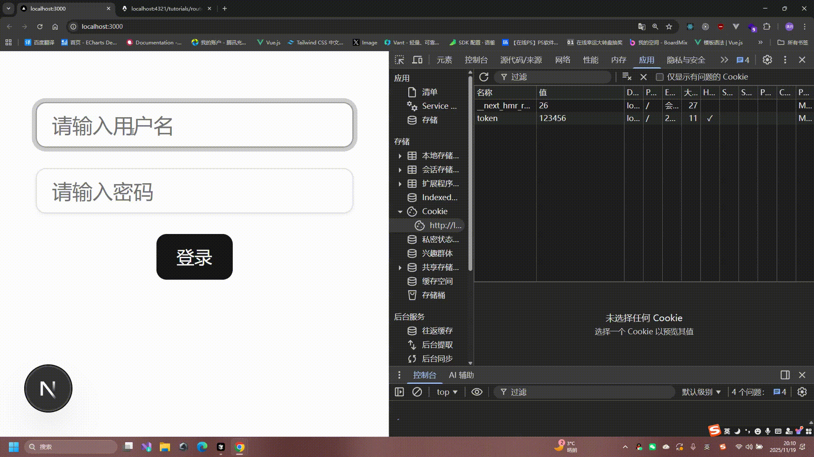

Next.js也内置了cookie的操作可以方便让我们读写，接下来我们用一个登录的例子来演示如何使用cookie。

安装手动挡组件库`shadcn/ui`[官网地址](https://ui.shadcn.com/)

```
npx shadcn@latest init
```

为什么使用这个组件库？因为这个组件库是把组件放入你项目的目录下面，这样做的好处是可以让你随时修改组件库样式，并且还能通过AI分析修改组件库

安装button,input组件

```
npx shadcn@latest add button
npx shadcn@latest add input
```

新建login接口 src/app/api/login/route.ts

```tsx
import { cookies } from "next/headers"; //引入cookies
import { NextRequest, NextResponse } from "next/server"; //引入NextRequest, NextResponse
//模拟登录成功后设置cookie
export async function POST(request: NextRequest) {
    const body = await request.json();
    if(body.username === 'admin' && body.password === '123456'){
        const cookieStore = await cookies(); //获取cookie
        cookieStore.set('token', '123456',{
            httpOnly: true, //只允许在服务器端访问
            maxAge: 60 * 60 * 24 * 30, //30天
        });
        return NextResponse.json({ code: 1 }, { status: 200 });
    }else{
        return NextResponse.json({ code: 0 }, { status: 401 });
    }
}
//检查登录状态
export async function GET(request: NextRequest) {
    const cookieStore = await cookies();
    const token = cookieStore.get('token');
    if(token && token.value === '123456'){
        return NextResponse.json({ code:1 }, { status: 200 });
    }else{
        return NextResponse.json({ code:0 }, { status: 401 });
    }
}
```

src/app/page.tsx

```tsx
'use client';
import { useState } from 'react';
import { Button } from '@/components/ui/button';
import { Input } from '@/components/ui/input';
import { useRouter } from 'next/navigation';

export default  function HomePage() {
    const router = useRouter();
    const [username, setUsername] = useState('');
    const [password, setPassword] = useState('');
    const handleLogin = () => {
        fetch('/api/login', {
            method: 'POST',
            headers: {
                'Content-Type': 'application/json',
            },
            body: JSON.stringify({ username, password }),
        }).then(res => {
            return res.json();
        }).then(data => {
            if(data.code === 1){
                router.push('/home');
            }
        });
    }
    return (
        <div className='mt-10 flex flex-col items-center justify-center gap-4'>
            <Input value={username} onChange={(e) => setUsername(e.target.value)} className='w-[250px]' placeholder="请输入用户名" />
            <Input value={password} onChange={(e) => setPassword(e.target.value)} className='w-[250px]' placeholder="请输入密码" />
            <Button onClick={handleLogin}>登录</Button>
        </div>
    )
}
```

src/app/home/page.tsx

```tsx
'use client';
import { useEffect } from 'react';
import { redirect } from 'next/navigation';
const checkLogin = async () => {
    const res = await fetch('/api/login');
    const data = await res.json();
    if (data.code === 1) {
        return true;
    } else {
        redirect('/');
    }
}
export default function HomePage() {
    useEffect(() => {
        checkLogin()    
    }, []);
    return <div>你已经登录进入home页面</div>;
}
```


# AI

Vercel提供了AI SDK，可以让我们在Next.js中轻松集成AI功能。[AI SDK 官网](https://ai-sdk.dev/getting-started)


### 安装AI-SDK

```
npm i ai @ai-sdk/deepseek @ai-sdk/react
```

这儿我们使用`deepseek`作为AI模型，`@ai-sdk/react`封装了流式输出和上下文管理hook，可以让我们在Next.js中轻松集成AI功能。如果你要安装其他模型，只需要将`deepseek`替换为其他模型即可。

例如：安装`openai`模型

```
npm i ai @ai-sdk/openai @ai-sdk/react
```

> 为什么使用`deepseek`模型？因为`deepseek`比较便宜，充10元可以测试很久(非广告)。

然后把生成的API Key复制一下保存起来。暂时放到src/app/api/chat/key.ts里面

### 编写API接口

src/app/api/chat/route.ts

```tsx
import { NextRequest } from "next/server";
import { streamText,convertToModelMessages } from 'ai'
import { createDeepSeek } from "@ai-sdk/deepseek";
import { API_KEY } from "./key";
const deepSeek = createDeepSeek({
    apiKey: DEEPSEEK_API_KEY, //设置API密钥
});
export async function POST(req: NextRequest) {
    const { messages } = await req.json(); //获取请求体
    //这里为什么接受messages 因为我们使用前端的useChat 他会自动注入这个参数，所有可以直接读取
    const result = streamText({
        model: deepSeek('deepseek-chat'), //使用deepseek-chat模型
        messages:convertToModelMessages(messages), //转换为模型消息
        //前端传过来的额messages不符合sdk格式所以需要convertToModelMessages转换一下
        //转换之后的格式：
        //[
            //{ role: 'user', content: [ [Object] ] },
            //{ role: 'assistant', content: [ [Object] ] },
            //{ role: 'user', content: [ [Object] ] },
            //{ role: 'assistant', content: [ [Object] ] },
            //{ role: 'user', content: [ [Object] ] },
            //{ role: 'assistant', content: [ [Object] ] },
            //{ role: 'user', content: [ [Object] ] }
        //]
        system: '你是一个高级程序员，请根据用户的问题给出回答', //系统提示词
    });
   
    return result.toUIMessageStreamResponse() //返回流式响应
}
```

src/app/page.tsx

我们在前端使用`useChat`组件来实现AI对话，这个组件内部封装了流式响应，默认会向`/api/chat`发送请求。

- `messages`: 消息列表，包含用户和AI的对话内容
- `sendMessage`: 发送消息的函数，参数为消息内容
- `onFinish`: 消息发送完成后回调函数，可以在这里进行一些操作，例如清空输入框

**messages**：数据结构解析

```json
[
    {
        "parts": [
            {
                "type": "text", //文本类型
                "text": "你知道 api router 吗"
            }
        ],
        "id": "FPHwY1udRrkEoYgR", //消息ID
        "role": "user" //用户角色
    },
    {
        "id": "qno6vcWcwFM4Yc8J", //消息ID
        "role": "assistant", //AI角色
        "parts": [
            {
                "type": "step-start" //步骤开始 
            },
            {
                "type": "text", //文本类型
                "text": "是的，我知道 **API Router**。", //文本内容
                "state": "done" //步骤完成
            }
        ]
    }
]

```


```
npx shadcn@latest add textarea
```


```tsx
'use client';
import { useState, useRef, useEffect } from 'react';
import { Button } from '@/components/ui/button';
import { Textarea } from '@/components/ui/textarea';
import { useChat } from '@ai-sdk/react';

export default function HomePage() {
    const [input, setInput] = useState(''); //输入框的值
    const messagesEndRef = useRef<HTMLDivElement>(null); //获取消息结束的ref
    //useChat 内部封装了流式响应 默认会向/api/chat 发送请求
    const { messages, sendMessage } = useChat({
        onFinish: () => {
            setInput('');
        }
    });

    // 自动滚动到底部
    useEffect(() => {
        messagesEndRef.current?.scrollIntoView({ behavior: 'smooth' });
    }, [messages]);
    //回车发送消息
    const handleKeyDown = (e: React.KeyboardEvent<HTMLTextAreaElement>) => {
        if (e.key === 'Enter' && !e.shiftKey) {
            e.preventDefault();
            if (input.trim()) {
                sendMessage({ text: input });
            }
        }
    };

    return (
        <div className='flex flex-col h-screen bg-linear-to-br from-blue-50 via-white to-purple-50'>
            {/* 头部标题 */}
            <div className='bg-white/80 backdrop-blur-sm shadow-sm border-b border-gray-200'>
                <div className='max-w-4xl mx-auto px-6 py-4'>
                    <h1 className='text-2xl font-bold bg-linear-to-r from-blue-600 to-purple-600 bg-clip-text text-transparent'>
                        AI 智能助手
                    </h1>
                    <p className='text-sm text-gray-500 mt-1'>随时为您解答问题</p>
                </div>
            </div>

            {/* 消息区域 */}
            <div className='flex-1 overflow-y-auto px-4 py-6'>
                <div className='max-w-4xl mx-auto space-y-4'>
                    {messages.length === 0 ? (
                        <div className='flex flex-col items-center justify-center h-full text-center py-20'>
                            <div className='bg-linear-to-br from-blue-100 to-purple-100 rounded-full p-6 mb-4'>
                                <svg className='w-12 h-12 text-blue-600' fill='none' stroke='currentColor' viewBox='0 0 24 24'>
                                    <path strokeLinecap='round' strokeLinejoin='round' strokeWidth={2} d='M8 10h.01M12 10h.01M16 10h.01M9 16H5a2 2 0 01-2-2V6a2 2 0 012-2h14a2 2 0 012 2v8a2 2 0 01-2 2h-5l-5 5v-5z' />
                                </svg>
                            </div>
                            <h2 className='text-xl font-semibold text-gray-700 mb-2'>开始对话</h2>
                            <p className='text-gray-500'>输入您的问题，我会尽力帮助您</p>
                        </div>
                    ) : (
                        messages.map((message) => (
                            <div
                                key={message.id}
                                className={`flex ${message.role === 'user' ? 'justify-end' : 'justify-start'} animate-in fade-in slide-in-from-bottom-4 duration-500`}
                            >
                                <div className={`flex gap-3 max-w-[80%] ${message.role === 'user' ? 'flex-row-reverse' : 'flex-row'}`}>
                                    {/* 头像 */}
                                    <div className={`shrink-0 w-8 h-8 rounded-full flex items-center justify-center text-white font-semibold ${
                                        message.role === 'user' 
                                            ? 'bg-linear-to-br from-blue-500 to-blue-600' 
                                            : 'bg-linear-to-br from-purple-500 to-purple-600'
                                    }`}>
                                        {message.role === 'user' ? '你' : 'AI'}
                                    </div>
                                    
                                    {/* 消息内容 */}
                                    <div className={`flex flex-col ${message.role === 'user' ? 'items-end' : 'items-start'}`}>
                                        <div className={`rounded-2xl px-4 py-3 shadow-sm ${
                                            message.role === 'user'
                                                ? 'bg-linear-to-br from-blue-500 to-blue-600 text-white'
                                                : 'bg-white border border-gray-200 text-gray-800'
                                        }`}>
                                            {message.parts.map((part, index) => {
                                                switch (part.type) {
                                                    case 'text':
                                                        return (
                                                            <div key={message.id + index} className='whitespace-pre-wrap wrap-break-word'>
                                                                {part.text}
                                                            </div>
                                                        );
                                                }
                                            })}
                                        </div>
                                    </div>
                                </div>
                            </div>
                        ))
                    )}
                    <div ref={messagesEndRef} />
                </div>
            </div>

            {/* 输入区域 */}
            <div className='bg-white/80 backdrop-blur-sm border-t border-gray-200 shadow-lg'>
                <div className='max-w-4xl mx-auto px-4 py-4'>
                    <div className='flex gap-3 items-end'>
                        <div className='flex-1 relative'>
                            <Textarea
                                value={input}
                                onChange={(e) => setInput(e.target.value)}
                                onKeyDown={handleKeyDown}
                                placeholder='请输入你的问题... (按 Enter 发送，Shift + Enter 换行)'
                                className='min-h-[60px] max-h-[200px] resize-none rounded-xl border-gray-300 focus:border-blue-500 focus:ring-2 focus:ring-blue-200 transition-all shadow-sm'
                            />
                        </div>
                        <Button
                            onClick={() => {
                                if (input.trim()) {
                                    sendMessage({ text: input });
                                }
                            }}
                            disabled={!input.trim()}
                            className='h-[60px] px-6 rounded-xl bg-linear-to-r from-blue-500 to-purple-600 hover:from-blue-600 hover:to-purple-700 transition-all shadow-md hover:shadow-lg disabled:opacity-50 disabled:cursor-not-allowed'
                        >
                            <svg className='w-5 h-5' fill='none' stroke='currentColor' viewBox='0 0 24 24'>
                                <path strokeLinecap='round' strokeLinejoin='round' strokeWidth={2} d='M12 19l9 2-9-18-9 18 9-2zm0 0v-8' />
                            </svg>
                        </Button>
                    </div>
                </div>
            </div>
        </div>
    );
}
```


# Proxy代理

> 从 Next.js 16 开始，中间件`Middleware`更名为代理`（Proxy）`，以更好地体现其用途。其功能保持不变

如果你想升级为16.x版本，Next.js提供了命令行工具来帮助你升级，只需要执行以下命令即可：

```
npx @next/codemod@canary middleware-to-proxy .
```

代码转换会将文件和函数名从middleware重命名为proxy。

```
// middleware.ts -> proxy.ts
 
- export function middleware() {
+ export function proxy() {复制
```

## 基本使用

应用场景：

- 处理跨域请求
- 接口转发例如/api/user -> (可能是其他服务器java/go/python等) -> /api/user
- 限流例如配合第三方服务做限流
- 鉴权/判断是否登录

Prxoy代理其实跟拦截器类似，它可以在请求完成之前进行拦截，然后进行一些处理，例如：修改请求头、修改请求体、修改响应体等。

src/proxy.ts

定义proxy函数导出即可，Next.js会自动调用这个函数。

```tsx
import { NextRequest, NextResponse } from "next/server";
export async function proxy(request: NextRequest) {
    console.log(request.url,'url');
}
```

但是你会发现，他会拦截项目中所有的请求，包括静态资源、API请求、页面请求等。

```
http://localhost:3000/.well-known/appspecific/com.chrome.devtools.json url
http://localhost:3000/_next/static/chunks/src_app_globals_91e4631d.css url
http://localhost:3000/_next/static/chunks/%5Bturbopack%5D_browser_dev_hmr-client_hmr-client_ts_cedd0592._.js url
http://localhost:3000/_next/static/chunks/node_modules_next_dist_compiled_react-dom_1e674e59._.js url
http://localhost:3000/_next/static/chunks/node_modules_next_dist_compiled_react-server-dom-turbopack_9212ccad._.js url
http://localhost:3000/_next/static/chunks/node_modules_next_dist_compiled_next-devtools_index_1dd7fb59.js url
http://localhost:3000/_next/static/chunks/node_modules_next_dist_compiled_a0e4c7b4._.js url
http://localhost:3000/_next/static/chunks/node_modules_next_dist_client_a38d7d69._.js url
http://localhost:3000/_next/static/chunks/node_modules_next_dist_4b2403f5._.js url
http://localhost:3000/_next/static/chunks/src_app_globals_91e4631d.css.map url
http://localhost:3000/_next/static/chunks/node_modules_%40swc_helpers_cjs_d80fb378._.js url
http://localhost:3000/_next/static/chunks/_a0ff3932._.js url
http://localhost:3000/api/login url复制
```

### 配置(config)

例如我们只想匹配`'/api'`下面的路径去做一些事情，我们可以使用`config`配置来实现。

```tsx
import { NextRequest, NextResponse } from "next/server";
export async function proxy(request: NextRequest) {
    console.log(request.url,'url');
}
//配置匹配路径
export const config = {
    matcher: '/api/:path*',
    //matcher: ['/api/:path*','/api/user/:path*'], 支持单个以及多个路径匹配
    //matcher: ['/((?!api|_next/static|_next/image|.*\\.png$).*)'], 同样支持正则表达式匹配
}
```

结合之前的案例,在cookie那一集，我们还需要单独定义check接口检查cookie，现在我们可以直接在proxy中实现。

```tsx
import { NextRequest, NextResponse } from "next/server";
export async function proxy(request: NextRequest) {
    const cookie = request.cookies.get('token');
    if (request.nextUrl.pathname.startsWith('/home') && !cookie) {
        console.log('redirect to login');
        return NextResponse.redirect(new URL('/', request.url));
    }
    if (cookie && cookie.value) {
        return NextResponse.next();
    }
    return NextResponse.redirect(new URL('/', request.url));
}

export const config = {
    matcher: ['/api/:path*', '/home/:path*'],
}
```

### 复杂匹配

- source: 表示匹配路径
- has: 表示匹配路径中必须(包含)某些条件
- missing: 表示匹配路径中(必须不包含)某些条件

**type** 只能匹配: header, query, cookie

```tsx
import { NextRequest, NextResponse } from "next/server";
import { ProxyConfig } from "next/server";
export async function proxy(request: NextRequest) {
   console.log('start proxy')
   return NextResponse.next();
}

export const config: ProxyConfig = {
    matcher: [
        {
            source: '/home/:path*',
            //表示匹配路径中必须(包含)Authorization头和userId查询参数
            has: [
                { type: 'header', key: 'Authorization', value: 'Bearer 123456' },
                { type: 'query', key: 'userId', value: '123' }
            ],
            //表示匹配路径中(必须不包含)cookie和userId查询参数
            missing: [
                { type: 'cookie', key: 'token', value: '123456' },
                { type: 'query', key: 'userId', value: '456' },
            ]
        },
    ]
}
```

访问url为：`http://localhost:3000/home?userId=123`

### 案例实战(处理跨域)

只要是/api下面的接口都可以被任意访问

```tsx
import { NextRequest, NextResponse } from "next/server";
import { ProxyConfig } from "next/server";
export async function proxy(request: NextRequest) {
    const response = NextResponse.next();
    Object.entries(corsHeaders).forEach(([key, value]) => {
        response.headers.set(key, value);
    })
    return response;
}

const corsHeaders = {
    'Access-Control-Allow-Origin': '*',
    'Access-Control-Allow-Methods': 'GET, POST, PUT, DELETE, OPTIONS',
    'Access-Control-Allow-Headers': 'Content-Type, Authorization',
}

export const config: ProxyConfig = {
   matcher:'/api/:path*',
}
```


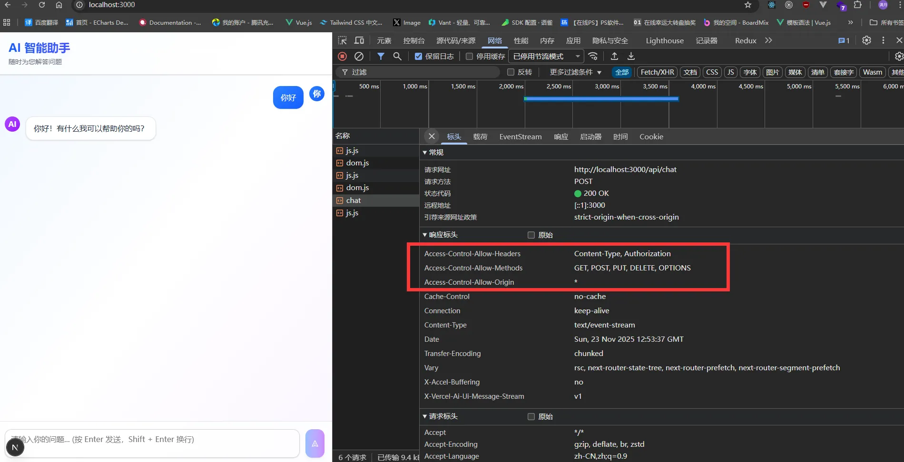


# Next.js CSS方案

在Next.js可以使用多种Css方案，包括：

- Tailwind CSS(个人推荐)
- CSS Modules(创建css模块化，类似于Vue的单文件组件)
- Next.js内置Sass(css预处理器)
- 全局Css(全局的css，可以全局使用)
- Style(内联样式)
- css-in-js(类似于React的styled-components，不推荐)

### Tailwind CSS

Tailwind CSS(原子化CSS)，他是一个css框架，可以让你快速构建网页，他提供了大量的css类，你只需要使用这些类，就可以快速构建网页。

[Tailwind CSS](https://tailwindcss.com/)

#### 安装教程

```
npx create-next-app@latest my-project
```

当我们去创建`Next.js`项目的时候，选择`customize settings(自定义选项)` 那么就会出现`Tailwind CSS`的选项，我们选择`Yes`即可。

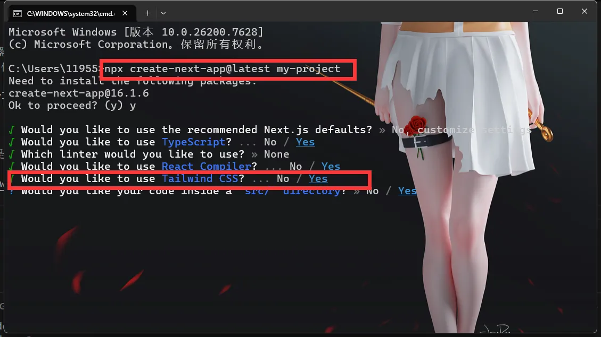

那么如果我在当时忘记选择`Tailwind CSS`，我该怎么安装呢？

[Next.js Tailwind CSS 安装教程](https://tailwindcss.com/docs/installation/framework-guides/nextjs)

#### 在 Next.js 中安装并使用 Tailwind CSS

下面是如何在 Next.js 项目中集成 Tailwind CSS 的详细流程：

##### 1. 创建你的 Next.js 项目

如果还没有项目，可以使用 Create Next App 快速初始化：

```
npx create-next-app@latest my-project --typescript --eslint --app
cd my-project
```

##### 2. 安装 Tailwind CSS 及相关依赖

通过 npm 安装 `tailwindcss`、`@tailwindcss/postcss` 以及 `postcss` 依赖：

```
npm install tailwindcss @tailwindcss/postcss postcss
```

##### 3. 配置 PostCSS 插件

在项目根目录下创建 `postcss.config.mjs` 文件，并添加如下内容：

```tsx
const config = {
  plugins: {
    "@tailwindcss/postcss": {},
  },
};
export default config;
```

##### 4. 导入 Tailwind CSS

在 `./app/globals.css` 文件中添加 Tailwind CSS 的导入：

```
@import "tailwindcss";
```

##### 5. 启动开发服务

运行开发服务：

```
npm run dev
```

##### 6. 在项目中开始使用 Tailwind

现在可以直接在组件或页面中使用 Tailwind CSS 的工具类来进行样式编写。例如：

```tsx
export default function Home() {
  return (
    <h1 className="text-3xl font-bold underline">
      Hello world!
    </h1>
  )
}
```

这样即可在项目中使用 Tailwind CSS 原子类来快速开发样式。

#### FAQ

这么多类名我记不住怎么办？

答：你不需要特意去记忆，tailwindCss的类名都是简称，例如`backdround-color:red` 你可以简写为`bg-red-500`。另外就是官网也提供文档可以查询，再其次就是还提供了`vscode`插件，可以自动补全类名。

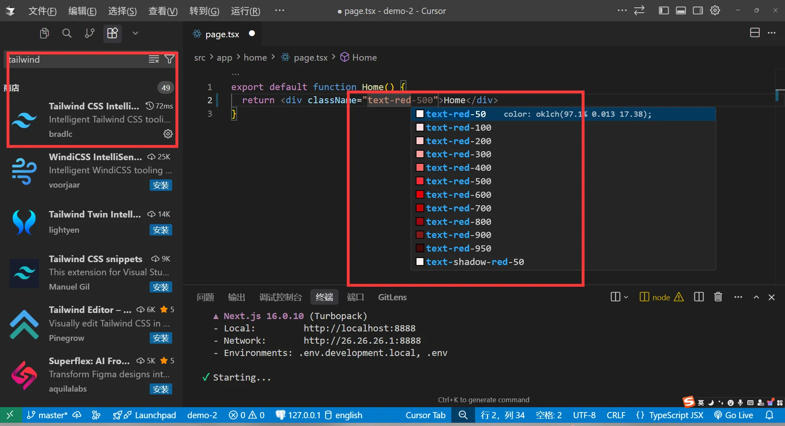


## CSS Modules

CSS Modules 是一种 CSS 模块化方案，可以让你在组件中使用CSS模块化，类似于Vue的单文件组件(scoped)。

Next.js已经内置了对CSS Modules的支持，你只需要在创建文件的时候新增`.module.css`后缀即可。例如`index.module.css`。

```tsx
/** index.module.css */
.container {
  background-color: red;
}复制
/** index.tsx */
import styles from './index.module.css';
export default function Home() {
  return (
    <div className={styles.container}>
      <h1>Home</h1>
    </div>
  )
}
```

你会发现他编译出来的类名，就会生成一个唯一的hash值，这样就可以避免类名冲突。

```
<h1 class="index-module__ifV0vq__test">小满zs Page</h1>
```

### Next.js内置Sass

Next.js已经内置了对Sass的支持，但是依赖还需要手动安装，不过配置项它都内置了，只需要安装一下即可。

```
npm install --save-dev sass
```

另外Next.js还支持配置全局sass变量，只需要在`next.config.js`中配置即可。

```tsx
import type { NextConfig } from 'next'
const config: NextConfig = {
  reactCompiler: true,
  reactStrictMode: false,
  cacheComponents:false,
  sassOptions:{
    additionalData: `$color: blue;`, // 全局变量
  }
}

export default config
```

### 全局Css

全局CSS，就是把所有样式应用到全局路由/组件，那应该怎么搞呢?

在根目录下创建`globals.css`文件，然后添加全局样式。

```tsx
/** app/globals.css */
body {
  background-color: red;
}
.flex{
    display: flex;
    justify-content: center;
    align-items: center;
}
```

在`layout.tsx`文件中引入`globals.css`文件。

```tsx
//app/layout.tsx
import './globals.css'
export default function RootLayout({ children }: { children: React.ReactNode }) {
  return (
    <html lang="en">
      <body>{children}</body>
    </html>
  )
}
```

### Style

Style，就是内联样式，就是直接在组件中使用style属性来定义样式。

```tsx
export default function Home() {
  return (
    <div style={{ backgroundColor: 'red' }}>
      <h1>Home</h1>
    </div>
  )
}
```

### css-in-js

css-in-js，就是把css + js + html混合在一起，拨入styled-components，不推荐很多人接受不了这种写法。

#### 1.安装启用styled-components

```
npm install styled-components
```

```tsx
import type { NextConfig } from 'next'
const config: NextConfig = {
  compiler:{
    styledComponents:true // 启用styled-components
  }
}
export default config
```

#### 2.创建style-component注册表

使用styled-componentsAPI 创建一个全局注册表组件，用于收集渲染过程中生成的所有 CSS 样式规则，以及一个返回这些规则的函数。最后，使用该useServerInsertedHTML钩子将注册表中收集的样式注入到`<head>`根布局的 HTML 标签中。

```tsx
//lib/registry.ts
'use client'
 
import React, { useState } from 'react'
import { useServerInsertedHTML } from 'next/navigation'
import { ServerStyleSheet, StyleSheetManager } from 'styled-components'
 
export default function StyledComponentsRegistry({
  children,
}: {
  children: React.ReactNode
}) {
  // Only create stylesheet once with lazy initial state
  // x-ref: https://reactjs.org/docs/hooks-reference.html#lazy-initial-state
  const [styledComponentsStyleSheet] = useState(() => new ServerStyleSheet())
 
  useServerInsertedHTML(() => {
    const styles = styledComponentsStyleSheet.getStyleElement()
    styledComponentsStyleSheet.instance.clearTag()
    return <>{styles}</>
  })
 
  if (typeof window !== 'undefined') return <>{children}</>
 
  return (
    <StyleSheetManager sheet={styledComponentsStyleSheet.instance}>
      {children}
    </StyleSheetManager>
  )
}
```

#### 3.注册style-component注册表

```tsx
//app/layout.tsx
import StyledComponentsRegistry from './lib/registry'
 
export default function RootLayout({
  children,
}: {
  children: React.ReactNode
}) {
  return (
    <html>
      <body>
        <StyledComponentsRegistry>{children}</StyledComponentsRegistry>
      </body>
    </html>
  )
}
```

#### 4.使用styled-components

```tsx
'use client';
import styled from 'styled-components';
const StyledButton = styled.button`
  background-color: red;
  color: white;
  padding: 10px 20px;
  border-radius: 5px;
`;
export default function Home() {
  return (
    <StyledButton>Click me</StyledButton>
  )
}
```


# RSC(React Server Components)

RSC(服务器组件)是React19`正式引入`的一种新的组件类型，它可以在服务器端渲染，也可以在客户端渲染。

像传统的`SSR`他是在服务器提前把页面渲染好，然后返回给浏览器，然后进行水合，`CSR`则是在客户端渲染，而`RSC`则是吸取两方优势，分为`服务器组件`和`客户端组件`。

举个例子:

例如我们有一个官网的页面，上面都是静态内容，但下面留言框是需要交互的。


此时我们就可以拆分成两个组件:

- 服务器组件: 上面都是静态内容，例如正文，标题，图片等，这类组件之所以适合在服务端执行，核心原因在于服务端渲染HTML+CSS的速度更快，生成的内容对搜索引擎完全可见，且无需客户端额外处理交互逻辑，完美匹配静态内容的需求。

```tsx
//Next.js 默认服务器组件
export default function HomePage() {
    return (
        <div>
            <h1>Home Page</h1>
        </div>
    )
}
```

- 客户端组件: 下面留言框是需要交互的，例如交互功能，如点赞按钮、计数器、表单等。这类组件需要依赖浏览器DOM事件、状态管理（useState）、副作用（useEffect）等客户端能力，必须在客户端完成渲染和水合（即添加事件处理程序的过程）才能实现交互效果

```tsx
'use client' //声明这是一个客户端组件
export default function HomePage() {
    return (
        <div>
            <h1>Home Page</h1>
        </div>
    )
}
```

### 渲染(RSC Payload)

SSR模式是在服务器直接渲染成`HTML`页面，返回给浏览器的，而`RSC`他是一种特殊的`紧凑的`格式

```
b2:["$","span",null,{"className":"line","children":["$","span",null,{"style":{"color":"var(--shiki-color-text)"},"children":"    })"}]}]
b3:["$","span",null,{"className":"line","children":[["$","span",null,{"style":{"color":"var(--shiki-color-text)"},"children":"  }"}],["$","span",null,{"style":{"color":"var(--shiki-token-punctuation)"},"children":","}],["$","span",null,{"style":{"color":"var(--shiki-color-text)"},"children":" [])"}]]}]
b4:["$","span",null,{"className":"line","children":" "}]
b5:["$","span",null,{"className":"line","children":[["$","span",null,{"style":{"color":"var(--shiki-color-text)"},"children":"  "}],["$","span",null,{"style":{"color":"var(--shiki-token-comment)"},"children":"// You can use `isPending` to give users feedback"}]]}]
b6:["$","span",null,{"className":"line","children":[["$","span",null,{"style":{"color":"var(--shiki-color-text)"},"children":"  "}],["$","span",null,{"style":{"color":"var(--shiki-token-keyword)"},"children":"return"}],["$","span",null,{"style":{"color":"var(--shiki-color-text)"},"children":" <"}],["$","span",null,{"style":{"color":"var(--shiki-token-string-expression)"},"children":"p"}],["$","span",null,{"style":{"color":"var(--shiki-color-text)"},"children":">Total Views: {views}</"}],["$","span",null,{"style":{"color":"var(--shiki-token-string-expression)"},"children":"p"}],["$","span",null,{"style":{"color":"var(--shiki-color-text)"},"children":">"}]]}]
```

那为什么这么做呢？因为我们的组件可以进行嵌套`服务器组件`>嵌套`客户端组件`>

黄色节点表示`服务器组件`，虚线节点表示`客户端组件` 

在这个结构中，Next.js就会标记哪些是客户端组件并且预留好位置，但是不会进行水合。

那么Next.js发现客户端组件也会在服务器生成这个结构，那干脆直接服务器里面把客户端组件进行预渲染(不包含交互)，这样我们就能快速看到数据，等他加载完成后再进行水合，所以客户端组件也会在服务器进行一次`预渲染`。

### 优点

- 将组件拆分成客户端组件和服务器组件，可以有效的减少`bundle`体积，因为`服务器组件`已经在服务器渲染好了，所以没必要打入`bundle`中,也就是说服务器组件所依赖的包都不会打进去，大大减少了`bundle`体积。
- 局部水合，像传统的SSR同构模式, 所有的页面都要在客户端进行水合，而`RSC`将组件拆分出来，只会把客户端组件进行水合，避免了全量水合带来的性能损耗。
- 流式加载，我们的HTML页面本来就支持流式加载，所以服务器组件可以边渲染边返回，提高了FCP(首次内容绘制)性能。

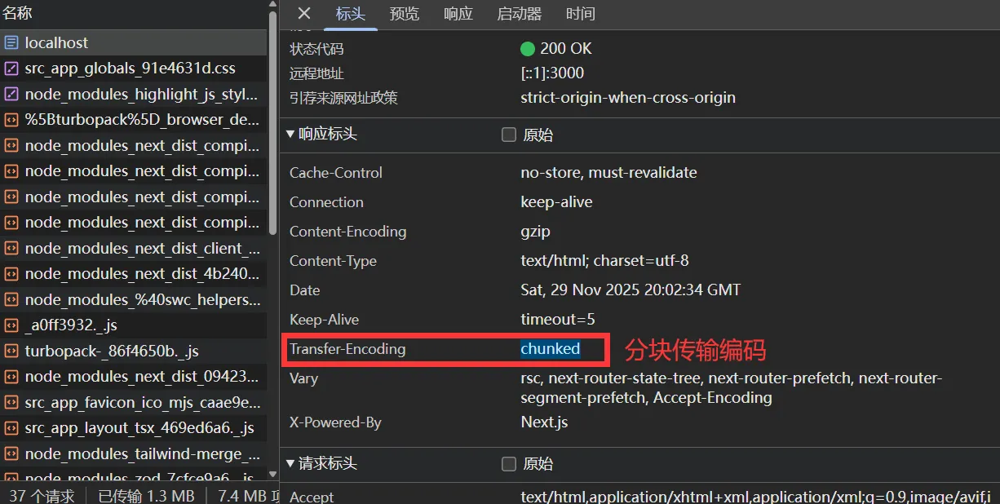


# 服务端组件(Server Components)

在默认情况下, `page` `layout` 都是服务端组件，服务端组件可以访问`node.js` API，包括处理数据库db。

src/app/server/page.tsx

```tsx
import fs from 'node:fs' //引入fs模块
import mysql, { RowDataPacket } from 'mysql2/promise' //操作数据库 仅供演示 非最佳实践
const pool = mysql.createPool({
    host: 'localhost',
    user: 'root',
    password: '123456',
    database: 'catering',
})

export default async function ServerPage() {
    const [rows] = await pool.query<RowDataPacket[]>('SELECT * FROM goods')
    const data = fs.readFileSync('data.json', 'utf-8')
    const json = JSON.parse(data)
    return (
        <div>
            <h1>Server Page</h1>
            {json.age}///{json.name}///{json.city}
            <h3>mysql</h3>
            {rows.map((item: any) => (
                <div key={item.id}>{item.name}-{item.goodsPrice}</div>
            ))}
        </div>
    )
}
```

data.json

```tsx
{
    "name": "John",
    "age": 30,
    "city": "New York"
}
```

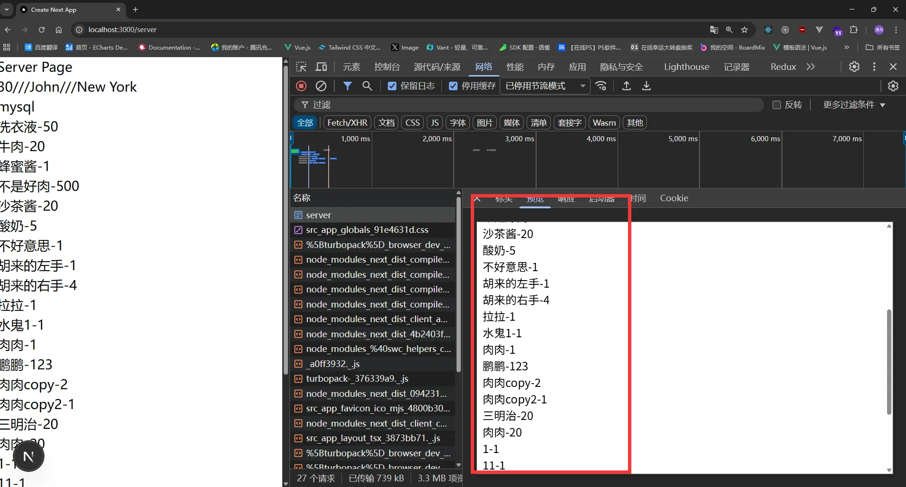 因为是在服务端渲染的所以日志会出现在控制台，那为什么控制台也会出现，是因为`Next.js`在本地开发模式方便我们调试进行的输出，后续生产环境就看不到了。

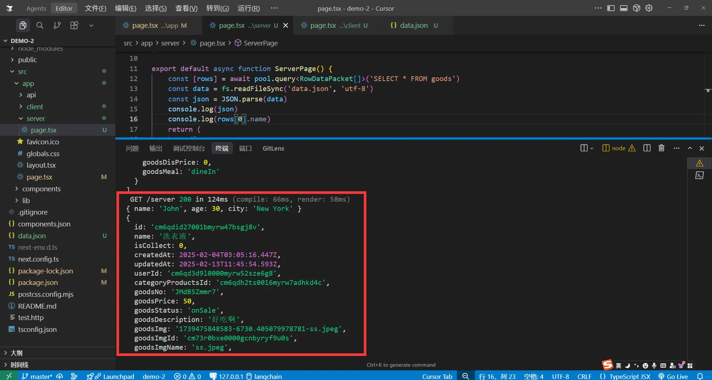

### 服务端组件的优点

- 安全性: 我们在服务端组件中访问一些API秘钥，令牌等其他机密，不会暴露给客户端。
- 体积: 因为服务端组件在服务器渲染，所以不会被打包到客户端，所以体积更小。
- 全栈：可以在服务端组件访问数据库，文件系统等其他API，实现全栈开发。
- FCP(首次内容绘制): 因为服务端组件是流式传输，所以边渲染边返回，提高了FCP(首次内容绘制)性能。

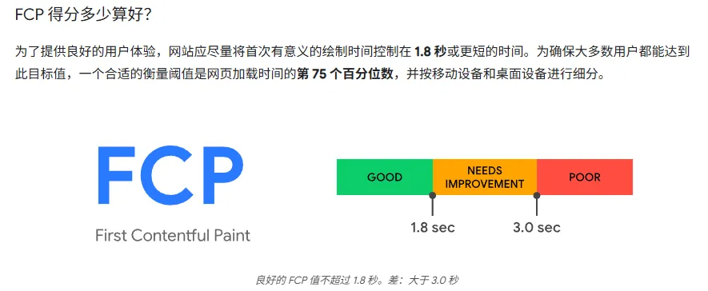

### 服务端组件的缺点

- 交互性: 因为服务端组件在服务器渲染，所以无法访问浏览器API，所以无法进行交互。
- hooks: `useEffect` `useState` 等hooks在服务端组件中无法使用。

JavaScript: 是由三部分组成的(ECMAScript,DOM,BOM)，在服务端组件只能使用`ECMAScript`部分，无法访问`DOM`和`BOM`。

ECMAScript: 就是我们常用的对象，数组，es6+等这些东西是通用的在客户端和服务端都能用。

> 如果要使用以下有交互性的功能，我们需要使用客户端组件。

```tsx
import { useEffect,useState } from 'react'
export default function ServerPage() {
    const [count, setCount] = useState(0)
    useEffect(() => {
        console.log(document,window)
    }, [])
    return (
        <div>
            <h1>Server Page</h1>
            <button onClick={() => setCount(count + 1)}>点击</button>
            <p>{count}</p>
        </div>
    )
}
```


# 客户端组件(Client Components)

声明客户端组件需要在文件的顶部编写 `'use client'` 声明这是客户端组件，但是注意客户端组件会在服务端进行一次`预渲染`，所以访问`document` `window` 等API需要在`useEffect`中访问。

```tsx
'use client'
import { useEffect,useState } from 'react'
console.log('client')
export default function ServerPage() {
    const [count, setCount] = useState(0)
    console.log('client X')
    useEffect(() => {
        console.log(document,window)
    }, [])
    return (
        <div>
            <h1>Server Page</h1>
            <button onClick={() => setCount(count + 1)}>点击</button>
            <p>{count}</p>
        </div>
    )
}
```

所以我们可以看到他把`useState`的0预渲染了出来这样可以让用户先看到页面。 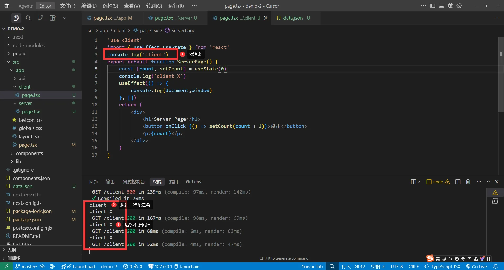 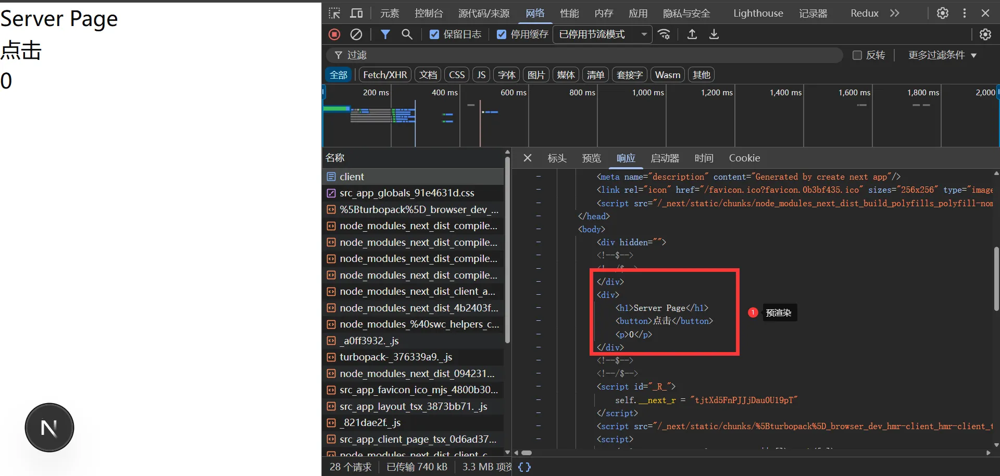

### 组件嵌套

> 服务端组件可以嵌套客户端组件，客户端只能嵌套不能嵌套服务端组件

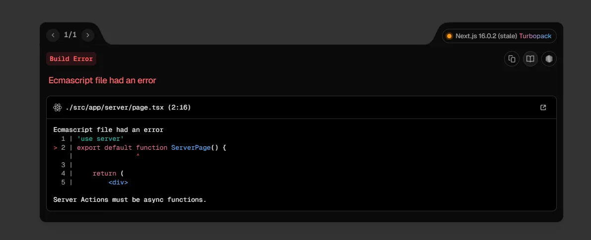

why:因为客户端会把他所有的模块以及子组件认为是客户端组件，那此时如果服务端组件用了`node.js`的API，或者其他服务端操作，那就会报错，因为客户端组件无法访问这些API，故此客户端组件不能嵌套服务端组件。

### server-only

随着Nodejs的发展，很多API已经可以跟浏览器共用了例如`fetch`,`webSocket`,未来Nodejs25支持`localStorage`等API,所以就会出现这种情况

下面这个函数可以在服务端组件使用，也可以在客户端组件使用，但有时候我们只想让他在服务端使用

```tsx
export default function useTest(type:0 | 1) {
    if (type === 0) {
        return fetch('https://api.github.com')
    } else {
        return new WebSocket('wss://api.github.com')
    }
}
```

```
npm install server-only
or
yarn add server-only
or
pnpm add server-only
```

安装完成这个包之后，只需要在文件的顶部编写 `import 'server-only'` 声明即可，这样他就会在服务端执行，在客户端执行会报错。

```tsx
import 'server-only'
export default function useTest(type:0 | 1) {
    if (type === 0) {
        return fetch('https://api.github.com')
    } else {
        return new WebSocket('wss://api.github.com')
    }
}
```

客户端使用报错: 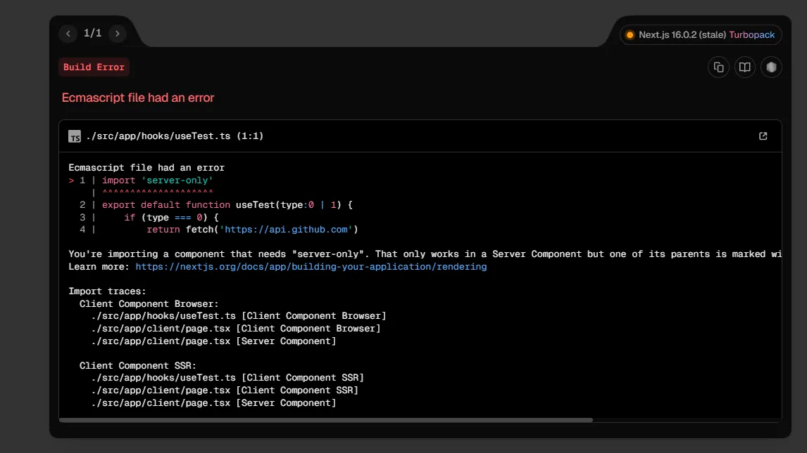


# 缓存组件(Cache Components)

### 什么是Cache Components?

Cache Components 是Next.js(16)版本特有的机制，实现了`静态内容` `动态内容` `缓存内容`的混合编排。保留了静态内容的加载速度，又具备动态渲染的灵活性，解决了`静态内容(加载快但无法实时更新数据)`和`动态内容(加载慢但可以实时更新数据)`权衡的问题。

- 静态内容: 构建(`npm run build`)时进行预渲染，例如 `「本地文件」「模块导入」「纯计算」（无网络请求、无用户相关数据）`,会被直接编译成`HTML`瞬间加载、立即响应。
- 动态内容：用户发起请求时才开始渲染的内容，依赖 “实时数据” 或 “用户个性化信息”，每次请求都可能生成不同结果，不会被缓存。例如`「实时数据源」（如实时接口、数据库实时查询）或「用户请求上下文」（如 Cookie、请求头、URL 参数）`。
- 缓存内容：缓存内容的本质就是缓存动态数据，缓存之后会被纳入`静态外壳(Static Shell)`,静态外壳就类似于`毛坯房`，会提前把结构搭建好，后续在通过(流式传输)填充里面的动态内容。

| 传统方案                           | Cache Components                           |
| ---------------------------------- | ------------------------------------------ |
| 静态页面：数据无法实时更新         | 支持缓存内容重新验证，动态内容流式补充     |
| 动态页面：初始加载慢、服务器压力大 | 静态外壳优先返回，动态内容并行渲染         |
| 客户端渲染：bundle 体积大、首屏慢  | 服务器预渲染核心内容，客户端仅补充动态部分 |

### 启用Cache Components

Cache Components 为可选功能，需在 Next 配置文件中显式启用：

next.config.ts

```tsx
import type { NextConfig } from "next";

const nextConfig: NextConfig = {
  cacheComponents: true, // 启用缓存组件
};

export default nextConfig;
```

#### 1. 静态内容展示

适用场景：仅依赖同步 I/O（如 fs.readFileSync）、模块导入、纯计算的组件

```tsx
import fs from 'node:fs'

export default async function Home() {
    const data = fs.readFileSync('data.json', 'utf-8') //本地文件读取
    const json = JSON.parse(data)
    const impData = await import('../../../data.json') //模块导入
    const names = impData.list.map(item=>item.name).join(',') //纯计算
    console.log(json)
    console.log(impData)
    console.log(names)
    return (
        <div>
            <h1>Home</h1>
            <ul>
                {json.list.map((item: any) => (
                    <li key={item.id}>{item.name} - {item.age}</li>
                ))}
            </ul>
        </div>
    )
}
```

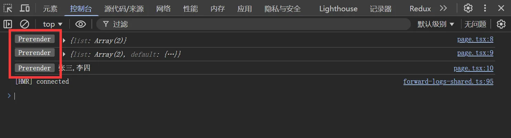

#### 2.1 动态内容展示

适用场景：fetch请求、cookies、headers等动态数据

> 动态内容必须配合Suspense使用。

```tsx
import { Suspense } from "react"
import { cookies } from "next/headers"

const DynamicContent = async () => {
    const data = await fetch('https://www.mocklib.com/mock/random/name') //随机生成一个名称
    const json = await data.json()
    console.log(json)
    const cookieStore = await cookies() //获取cookie
    console.log(cookieStore)
    return (
        <div>
            <h2>动态内容</h2>
            <main>
                <ul>
                    <li>名称：{json.name}</li>
                </ul>
            </main>
        </div>
    )
}

export default async function Home() {

    return (
        <div>
            <h1>Home</h1>
            <Suspense fallback={<div>动态内容Loading...</div>}>
                <DynamicContent />
            </Suspense>
        </div>
    )
}
```

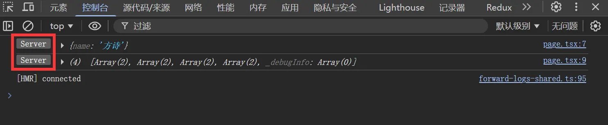

#### 2.2 实现原理

Next.js 会通过`(Partial Prerendering/PPR)`技术,实现静态外壳(Static Shell)渲染，提供占位符，当用户请求时，再通过流式传输(Streaming)填充里面的动态内容，以此提升首屏加载速度和用户体验。

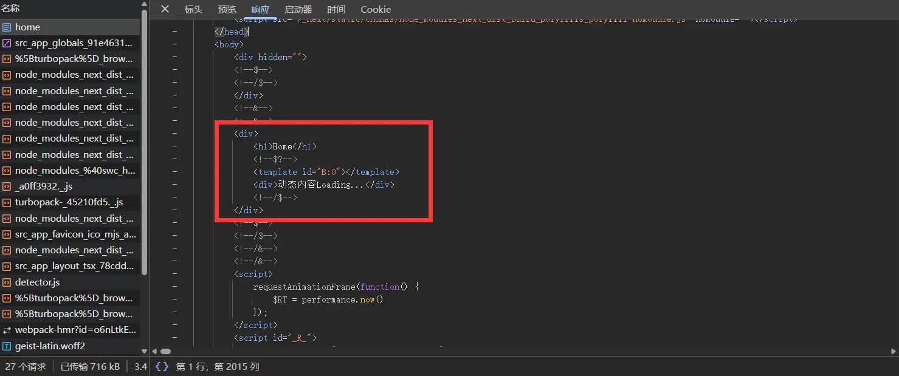 我们观察上图

- `<h1>Home</h1>`： 纯静态内容，属于静态外壳的一部分，构建 / 请求时直接渲染，浏览器能立即显示。
- `<template id="B:0"></template>` 动态内容的容器模板，后续用来挂载异步加载的动态内容
- `<div>动态内容Loading...</div>`：占位符（fallback），属于静态外壳的一部分，在动态内容加载完成前显示。

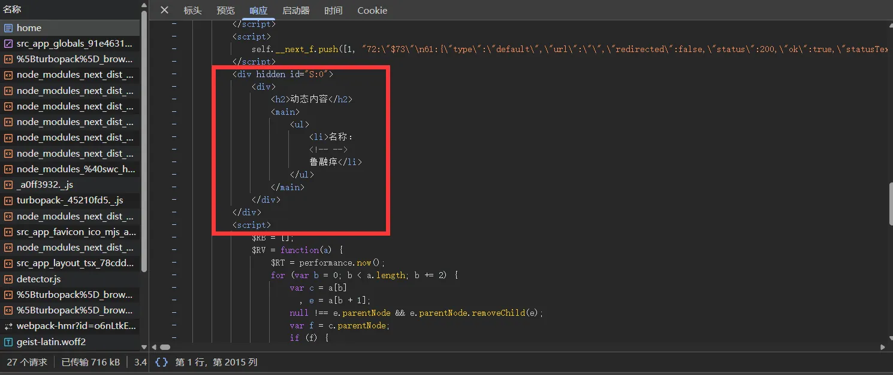

- 这个 `<div>` 初始为 hidden，是服务器异步渲染完成的动态内容，等待客户端脚本触发后替换到占位符位置。
- id=“S:0” 与前面的 `<template id="B:0">` 一一对应，是 “动态内容 - 占位符” 的关联标识。

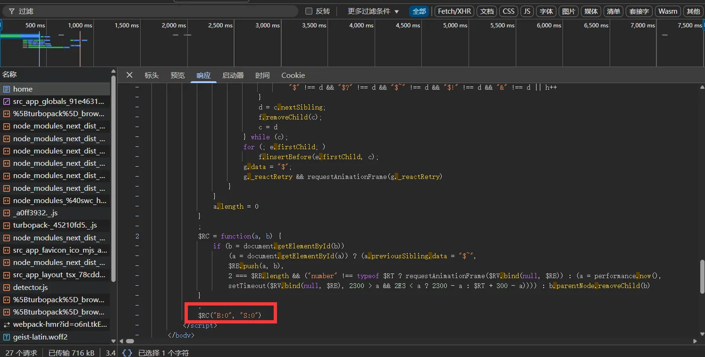

```
$RC("B:0", "S:0") // 关键调用：关联 B:0 占位符和 S:0 动态内容
```

- $RC（React Content Replace）：找到 id=“B:0” 的占位符和 id=“S:0” 的动态内容，将其加入替换队列 $RB。
- $RV（React Content Render）：在动画帧 / 超时后执行替换，移除加载占位符，将动态内容插入到页面中，完成最终渲染。

#### 2.3 非确定操作

例如: `随机数`、`时间戳`等非确定操作，每次请求都可能生成不同结果。

直接使用就会报错如下：

> Error: Route “/home” used `Math.random()` before accessing either uncached data (e.g. `fetch()`) or Request data (e.g. `cookies()`, `headers()`, `connection()`, and `searchParams`). Accessing random values synchronously in a Server Component requires reading one of these data sources first. Alternatively, consider moving this expression into a Client Component or Cache Component. See more info here: <https://nextjs.org/docs/messages/next-prerender-random> at DynamicContent (page.tsx:5:25) at Home (page.tsx:27:17)

解决方案：

使用Suspense包裹，然后使用connection表示不要预渲染这部分。

Next.js默认会尝试尽可能多地静态预渲染页面内容。但像 `Math.random()` 这样的值每次调用结果都不同，如果在预渲染时执行，那这个”随机值”就被固定了，失去了意义。 通过在 Math.random() 之前调用 await connection()，你明确告诉 Next.js：

- 不要预渲染这部分
- 等真正有用户请求时再执行

```tsx
import { Suspense } from "react"
import { connection } from "next/server"

const DynamicContent = async () => {
    await connection() //使用connection表示不要预渲染这部分
    const random = Math.random()
    const now = Date.now()
    console.log(random, now)
    return (
        <div>
            <h2>动态内容</h2>
            <main>
                <ul>
                    <li>名称：{random}</li>
                    <li>时间：{now}</li>
                </ul>
            </main>
        </div>
    )
}

export default async function Home() {

    return (
        <div>
            <h1>Home</h1>
            <Suspense fallback={<div>动态内容Loading...</div>}>
                <DynamicContent />
            </Suspense>
        </div>
    )
}
```

#### 3. 缓存内容展示

缓存组件，可以使用`use cache`声明这是一个缓存组件，然后使用`cacheLife`声明缓存时间。

cacheLife参数：

- `stale`：客户端在此时间内直接使用缓存，不向服务器发请求`(单位:秒)`
- `revalidate`：超过此时间后，服务器收到请求时会在后台重新生成内容`(单位:秒)`
- `expire`：超过此时间无访问，缓存完全失效，下次请求需要等待重新计算`(单位:秒)`

预设参数:

| Profile | 适用场景                   | stale | revalidate | expire |
| ------- | -------------------------- | ----- | ---------- | ------ |
| seconds | 实时数据（股票、比分）     | 30秒  | 1秒        | 1分钟  |
| minutes | 频繁更新（社交动态）       | 5分钟 | 1分钟      | 1小时  |
| hours   | 每日多次更新（库存、天气） | 5分钟 | 1小时      | 1天    |
| days    | 每日更新（博客文章）       | 5分钟 | 1天        | 1周    |
| weeks   | 每周更新（播客）           | 5分钟 | 1周        | 30天   |
| max     | 很少变化（法律页面）       | 5分钟 | 30天       | 1年    |

```tsx
import { Suspense } from "react"
import { cacheLife } from "next/cache"

const DynamicContent = async () => {
    'use cache'
    cacheLife("hours") //使用预设参数
    //cacheLife({stale: 30, revalidate: 1, expire: 1}) //使用自定义参数
    const data = await fetch('https://www.mocklib.com/mock/random/name')
    const json = await data.json()
    console.log(json)
    return (
        <div>
            <h2>动态内容</h2>
            <main>
                <ul>
                    <li>名称：{json.name}</li>
                </ul>
            </main>
        </div>
    )
}

export default async function Home() {

    return (
        <div>
            <h1>Home</h1>
            <Suspense fallback={<div>动态内容Loading...</div>}>
                <DynamicContent />
            </Suspense>
        </div>
    )
}
```

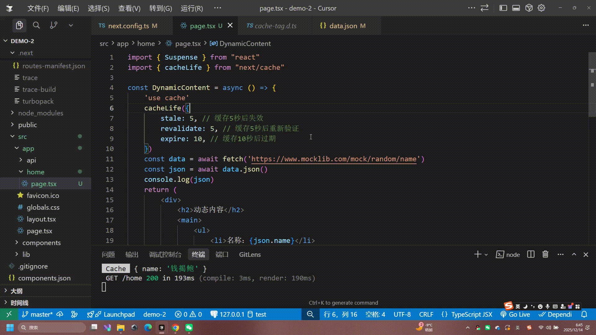


# end